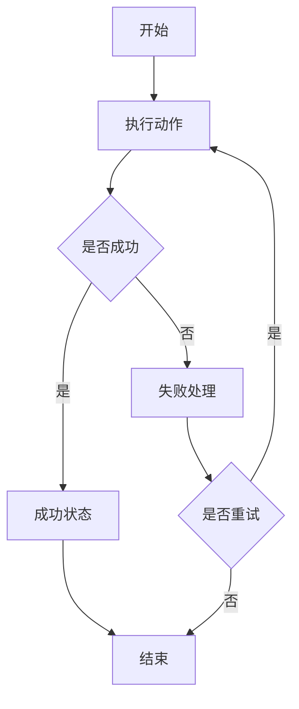
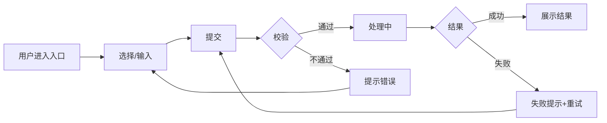
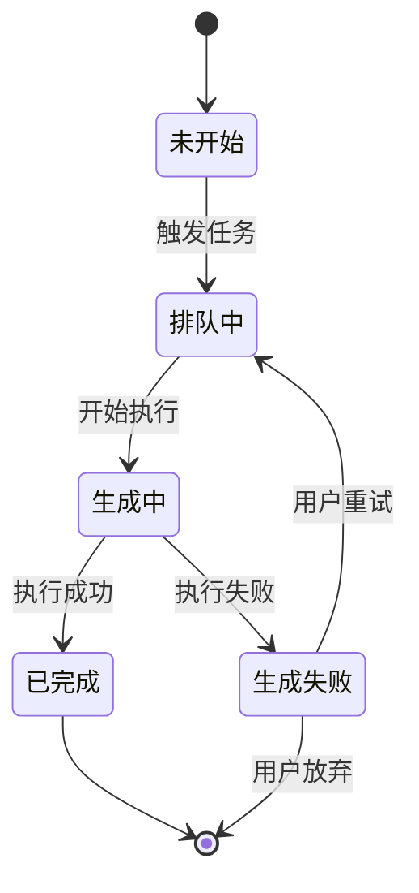
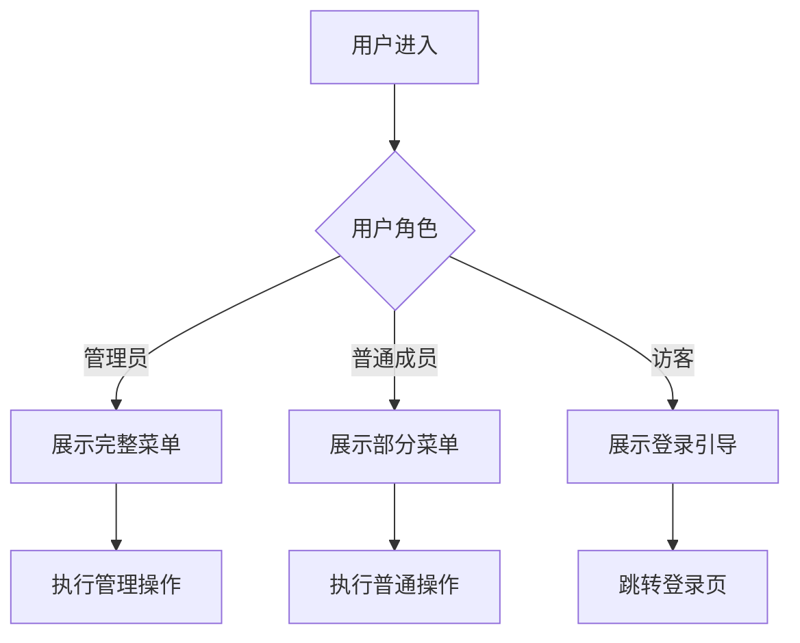
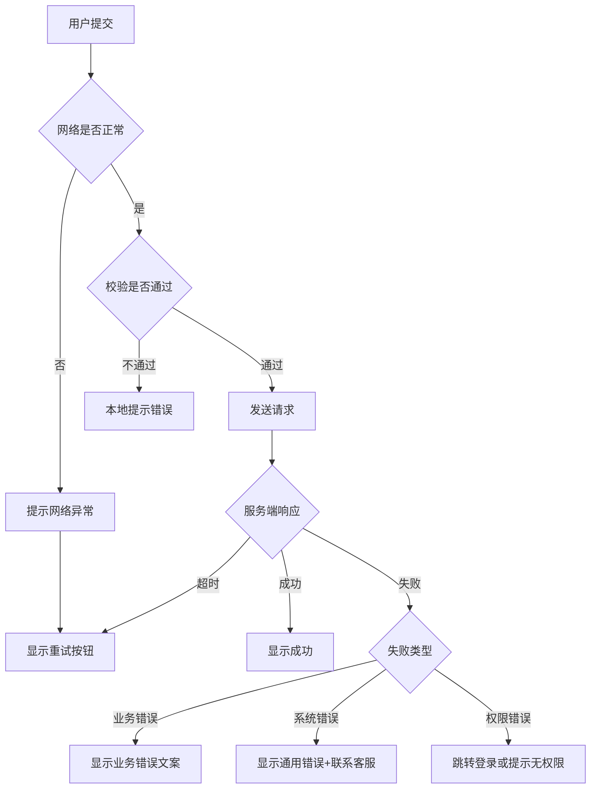
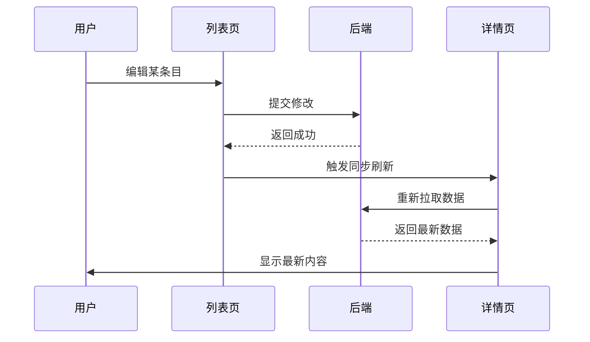

# Mermaid 流程图模板

> 用于"核心用户动线"、"状态机"等需要流程可视化的场景。
> 飞书/Lark 文档支持 Mermaid 渲染（可能需要安装 Mermaid 插件）。

---

## 模板 1：基础流程图（带成功/失败分支）

---

## 模板 2：核心用户动线（标准 PRD 用）

---

## 模板 3：状态机（任务/流程状态流转）

---

## 模板 4：用户角色分支（不同角色不同路径）

---

## 模板 5：异常分支详细版

---

## 模板 6：多步骤引导流程

---

## 模板 7：数据同步流程

---

## 绘制要点

### ✅ 推荐做法

1. **节点用名词或简短动作**：`[提交订单]` 而不是 `[用户提交订单到后端处理]`
2. **判断节点用菱形 `{}`**：`{是否登录}`
3. **分支条件简短**：`-- 是 -->` `-- 否 -->`
4. **方向选择**：
   - `TD`（top-down）：垂直流程，适合分支多
   - `LR`（left-right）：水平流程，适合步骤多
5. **覆盖主流程 + 1-2 个关键异常分支**

### ❌ 避免做法

1. ❌ 节点写成长句子（影响渲染）
2. ❌ 在流程图里写规则细节（流程图只做视觉表达，规则细节在文字部分）
3. ❌ 一张图画太多分支（>15 个节点建议拆分多张图）
4. ❌ 不同图的方向不统一（同一份 PRD 内尽量统一 TD 或 LR）

---

## 飞书/Lark 兼容性

- ✅ 飞书文档支持 Mermaid 渲染（在代码块语言标签写 `mermaid`）
- ✅ 复制 Mermaid 代码块时保留三个反引号 + `mermaid` 标签
- ⚠️ 如果飞书没有 Mermaid 插件，可以用[在线 Mermaid 编辑器](https://mermaid.live)生成 PNG 后插入
