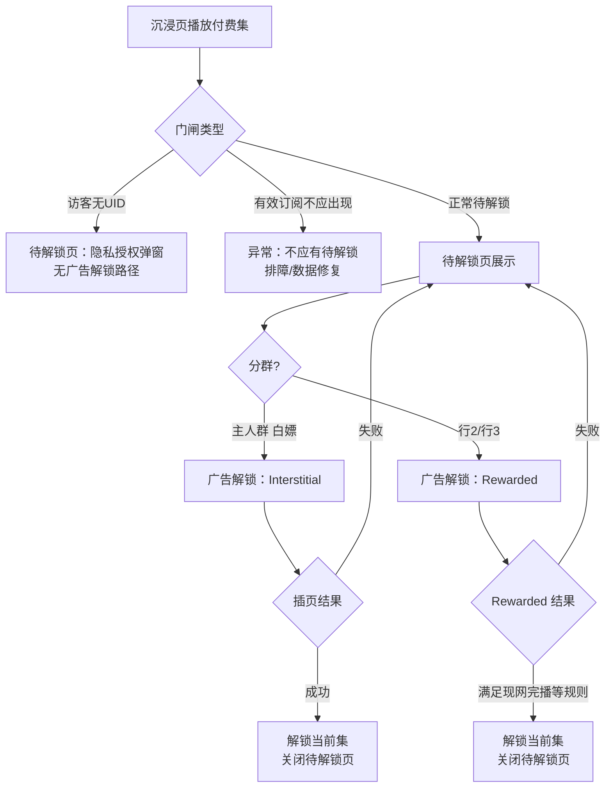

# FlareFlow · 待解锁页「广告解锁」改插页广告 — PRD

## 1. 产品概述

### 1.1 背景

**主目标人群**（见 §2.0）在观看需解锁剧集时会进入**待解锁页**（或等价全屏/半屏门闸 UI）。当前实现中，该人群在待解锁页选择「看广告解锁」时，产品期望改为展示**插页广告（Interstitial）**并完成解锁，以替代原**激励视频（Rewarded）**形态。历史需求索引中曾将「广告解锁」与激励视频绑定；本需求在**已拍板范围**内做一次路径级调整。**非主人群**在同一页面的行为须严格按 §2.0 矩阵执行；与 **访客模式**、**有效订阅** 的全局关系见 **§2.3**。

### 1.2 问题陈述

1. 待解锁场景下，激励视频链路偏重、跳出感与完播依赖强，与「快速换一集解锁」心智不完全一致。  
2. 需在不波及其他广告位的前提下，**仅**收敛待解锁页的「广告解锁」广告形态。

### 1.3 目标

| 目标 | 可验收描述 |
|------|------------|
| 形态切换 | **待解锁页**内用户点「广告解锁」→ 拉起 **Interstitial**；**不再**在该路径拉起 **Rewarded**。 |
| 解锁语义 | 在 **插页广告展示结束且用户关闭/自然结束后**（与产品确认一致），完成**当前待解锁集**的「广告解锁」结果（与现网「一次广告解锁消耗一次配额」语义对齐，配额规则见 §1.5）。 |
| 范围可控 | 其它页面/入口的激励或插页策略**不因本需求默认变更**（见 §1.4）。 |

### 1.4 非目标

- **不改**充值面板、任务中心、签到、Reels 内其它广告位等处的激励/插页策略（除非另行立项）。  
- **不改**订阅、金币购买、纯登录解锁等其它待解锁页按钮逻辑（仅改「广告解锁」所触发的广告单元类型与回调语义）。  
- **不**在本 PRD 中规定具体广告平台类名、placement id、服务端灰度字段名（见 §8.3 / §8.4 研发深化）。  
- **不因**本需求将待解锁「广告解锁」由激励改为插页而**主动扩写**隐私/条款披露或新增同意链路；**维持现网披露范围**（2026-05-13 PM 拍板，见 §7）。若特定市场后续法规或法务有新要求，**单独立项**处理。

### 1.5 已确认决策（对话拍板）

| # | 决策项 | 结论 |
|---|--------|------|
| D1 | 解锁触发 | **可以**：以 **插页关闭/结束** 作为解锁触发点（与「看完激励再解锁」用户心智对齐）。 |
| D2 | 范围 | **只改待解锁页**上「广告解锁」路径；其它入口不动。 |
| D4 | §2.0 行2 曾有付费、当前无订 | 待解锁页「广告解锁」**仍激励**（Rewarded）。 |
| D5 | §2.0 行3 新注册/低活跃 | 待解锁页「广告解锁」**仍激励**。 |
| D6 | §2.0 行4 有效订阅 | **有效订阅覆盖下不出现**付费集待解锁门闸；若线上出现待解锁+订阅并存视为**异常/脏数据**，走排障与数据修复，**不适用**本需求广告形态切换。 |
| D7 | §2.0 行5 访客模式 | **不可**通过广告/付费在待解锁页解锁剧集；该页展示**同意隐私条款**弹窗（与访客 PRD 一致），不展示「广告解锁」主路径。 |
| D8 | 「历史从未付费」口径 | 以**成功付费/扣款**为「有付费史」依据；**全额退款或订单撤销后净额为 0** 的订单 **不计入**「曾成功付费」，用户仍可落入「历史从未付费」。0 元单、试用未扣款等边缘情形 **以订单/财务系统真值为准**（与本条不矛盾时仍适用「无任何净额 >0 的成功付费单」即从未付费）。 |
| D9 | 「活跃」「白嫖」写法 | **活跃**：有 **App 启动/打开**（可落库为冷启动或前台会话；**统计窗口 N 日**由数据/远程配置收口，本 PRD 不锁死 N）。**白嫖**：产品口语 **等价于「历史从未成功付费」**，与矩阵「历史以来无成功付费」**同一判定**，**不另设**独立「白嫖」指标。 |
| D10 | 插页用于「解锁内容」披露 | **维持现网**披露即可，PRD **不扩写**新披露章节（见 §7）。 |
| D11 | 激励/广告失败与配额 | 与现网「失败是否扣次」「提前关闭是否扣次」等若与本 PRD 历史表述冲突：**以现网实现为准**；研发核对双端后沉淀真值表并回写 §5.2.3 / 场景与验收（见 §7）。 |

**配额与频控**：与现网「广告解锁次数/按剧配置次数」等策略**保持一致**；本需求不新增/削减配额，仅更换主人群路径所对应广告形态。**失败、提前关闭、重试等是否消耗配额**遵循 **D11：与现网一致**；插页与激励须共用**同一套配额扣减规则**并由研发列 iOS/Android 对照真值表（⚠️ 研发深化，含幂等与防重复扣次实现方式）。

### 1.6 与相关 PRD 的关系

- **`docs/20260513/PRD/访客模式与游客身份/20260513_访客模式与游客身份_PRD.md`**：定义访客/游客/登录与付费集门闸；本需求在其门闸之内调整**广告解锁**实现形态。  
- 冲突时：**本 PRD §1.5 拍板** + 访客 PRD 对身份/付费边界 > 历史 docx 摘录。

---

## 2. 目标用户与使用场景

### 2.0 用户分群与策略矩阵（产品真理源 · **已拍板**）

> **回填状态**：下列非主人群「广告形态 / 门闸」已由 PM 确认；**主人群**可判定口径见 **§1.5 D8–D9** 与 **§7.1**；「活跃」统计窗口 **N 日**由数据/配置收口（本 PRD 不锁死 N）。

| 分群（产品命名） | 判定摘要 | 待解锁页「广告解锁」形态 / 门闸行为 | 是否在本需求范围内 |
|------------------|----------|--------------------------------------|----------------------|
| **主目标人群：历史未付费且活跃的白嫖用户** | **历史以来**无「曾成功付费」记录（**D8**：全退/撤销后净额 0 不算有付费史；边缘单以订单系统为准）；**活跃** = 有 **App 启动/打开**（**D9**；统计窗口 ⚠️ 数据/配置）；**白嫖** 与「从未成功付费」**同义**，不另设指标 | **Interstitial**（本需求主路径） | 是 |
| 曾有付费、当前无有效订阅 | 历史存在成功付费；当前订阅已过期或未持有 | **仍激励**（Rewarded），不因本需求改为插页 | 是（对照组行为） |
| 新注册用户（低活跃 / 冷启动） | 注册后冷启动策略 ⚠️ 可与数据对齐标签 | **仍激励**（Rewarded） | 是（对照组行为） |
| **有效订阅用户** | 当前持有覆盖本内容的有效订阅 | **不出现**付费集「待解锁」门闸（见 **§2.3**）；本行不适用「广告解锁改插页」 | **否**（门闸不应出现；若出现为异常） |
| **访客模式（无 UID）** | 未同意隐私条款，无游客 UID | **不可解锁剧集**；待解锁页展示 **同意隐私条款**弹窗，**不**提供「广告解锁」完成解锁的路径（与访客 PRD 对齐） | 是（与访客 PRD 协同；非插页/激励二选一） |

**矩阵回填完成标准**：上表「门闸行为」列已无空白；主人群 **predicate 语义** 已拍板（§1.5 D8–D9 / §7.1）；**活跃窗口 N、事件名** 为数据/远程配置项，研发可先行占位，上线前与数据对齐。

### 2.1 订阅与访客 · 全局规则（须与访客 PRD 一致实现）

1. **有效订阅**：在订阅权益**覆盖当前集/当前剧**的前提下，产品规则为 **不应出现** 付费集待解锁页。若用户界面仍出现待解锁与「已订阅」并存，按 **Bug / 数据不一致** 处理，**不在本需求范围**内用广告形态修补。  
2. **访客模式**：用户**不可**通过广告或付费在待解锁页解锁；应引导 **同意隐私条款**（进入游客 UID 路径后再按游客/登录规则处理付费集）。详见 **`docs/20260513/PRD/访客模式与游客身份/20260513_访客模式与游客身份_PRD.md`**。

### 2.2 目标用户（主目标人群 · 与 §2.0 第一行一致）

- **历史以来未付费且活跃的白嫖用户**（「白嫖」与「从未成功付费」同义，见 **§7.1**）：在**付费集门闸**场景下会进入待解锁页，并倾向通过**广告**换取单次观看；本需求将此类用户在**待解锁页**的「广告解锁」由激励改为 **Interstitial**。  
- **不包含**（除非 §2.0 另行扩写）：未在矩阵中定义、或 PM 声明「与主人群策略不同」的其它人群——其行为**不得**由本 PRD 默认推断。

### 2.3 使用场景（≥3 · 含主人群与对照分群）

**场景 A — 主人群正常解锁**

1. 主人群用户播放付费集触发待解锁页。  
2. 用户点「看广告解锁」（或当前产品对该能力的等价文案）。  
3. App 展示 **Interstitial**；用户关闭或播完后，**当前集**按现网规则标记为已广告解锁，进入可播放态。

**场景 B — 广告未填充**

1. 同场景 A 步骤 1–2。  
2. 插页无填充或展示失败 → 用户仍停留在待解锁页，展示明确错误/重试（见 §5.2.4）；**是否消耗广告解锁配额以现网行为为准**（**D11**），研发在真值表中与激励路径对齐后回写验收。

**场景 C — 用户提前关闭插页**

1. 用户点「看广告解锁」→ 插页展示。  
2. 用户在平台允许「可跳过」时机提前关闭 → **不**解锁当前集，回到待解锁页；**是否消耗配额以现网行为为准**（**D11**）；各平台对 interstitial「完成」定义不同处由研发在 §8.3 收口为与**线上一致**的产品规则。

---

**场景 D — 非主人群仍激励（行 2 / 行 3）**

1. 用户命中 §2.0「曾有付费」或「新注册低活跃」分群，进入待解锁页。  
2. 用户点「看广告解锁」→ 展示 **Rewarded**（与改插页前一致），**不**走本需求主路径的 Interstitial。  

**场景 E — 访客模式（行 5）**

1. 访客用户触发付费集门闸 → 待解锁页展示 **同意隐私条款**弹窗为主交互，**不**提供通过广告解锁当前集的路径。  
2. 用户同意条款后身份切换按访客 PRD；本需求**不**描述后续解锁细节。

---

## 3. 核心用户路径



> 说明：「有效订阅不应出现」为**断言式产品规则**；图中 **ERR** 为研发/运维排障路径，非功能需求分支。

---

## 4. 功能范围总览

| 模块 | 做 | 不做 |
|------|----|------|
| 待解锁页 · 广告解锁 | **主人群**：激励 → **插页**；**行 2/3**：仍激励；**访客**：无广告解锁路径；解锁触发见 §1.5 / §5.2.3 | 改订阅全局规则（见 §2.1） |
| 其它页面任意「看广告」 | — | **不改** |
| 配额/频控/按剧次数 | 与现网一致 | 本需求不调整数值策略 |

---

## 5. 功能详细描述

> **目标读者**：前端、广告/SDK 集成、QA。

### 5.1 名词

| 名词 | 含义 |
|------|------|
| 待解锁页 | 用户因权限/付费原因无法继续播放当前集时展示的门闸 UI（全屏/半屏以设计为准）。 |
| 广告解锁 | 用户通过观看一次广告换取**当前集**播放权的业务能力；本需求仅改其**广告形态为插页**。 |
| Interstitial / Rewarded | 分别指插页广告、激励视频广告单元（具体 SDK 类型名 ⚠️ 研发深化）。 |

### 5.2 待解锁页 ·「广告解锁」路径

#### 5.2.1 交互与线框（ASCII · Before / After）

**行为差异说明**：**主目标人群**——点「看广告解锁」→ **插页**；**§2.0 行 2 / 行 3**——同一按钮仍走 **Rewarded**；**访客**——待解锁页以 **同意隐私条款** 为主交互，**不提供**「看广告解锁」路径（见 §2.0 第五行）。

**主人群 · After（线框）**

```
┌─────────────────────────────────────────┐
│  [×]                                    │
│  Unlock this episode                    │
│  ─────────────────────────────────────  │
│  [ Subscribe ]  [ Coins ×N ]            │
│  [ Watch ad to unlock ]   ← 主人群：点按后插页 │
└─────────────────────────────────────────┘
        │
        ▼  （插页由 SDK 绘制）
     [ Interstitial Ad ]
        │
        ▼ 关闭/结束后 → 当前集可播，待解锁页关闭
```

**访客模式 · 待解锁页（线框 · 无广告解锁）**

```
┌─────────────────────────────────────────┐
│  [×]                                    │
│  Unlock this episode                    │
│  ─────────────────────────────────────  │
│  [ Agree to Privacy Policy ]  ← 主 CTA   │
│  （不展示「看广告解锁」完成本集解锁）      │
└─────────────────────────────────────────┘
```

#### 5.2.2 控件与动作（5.x.3 风格清单）

| id | 控件 | 可见条件 | 点击/触发 | 成功反馈 | 失败/边界 |
|----|------|----------|-----------|----------|-----------|
| sec-5-2-2-c1 | 「看广告解锁」 | **非访客**；命中 §2.0 **主人群或行 2 或行 3**；仍有可用广告解锁次数；当前集待解锁 | **主人群**：请求 **Interstitial**；**行 2/3**：请求 **Rewarded**（仍激励） | 对应广告形态达成成功条件后解锁并关门闸 | 无填充：toast；连点：防抖 |
| sec-5-2-2-c2 | 关闭待解锁页（× 或系统返回） | 始终（若设计允许） | 关闭门闸 | 回到上一层 | 与现网一致 |
| sec-5-2-2-c3 | 其它付费入口（订阅/金币等） | 现网规则；**访客下须符合访客 PRD 门闸** | 走原链路 | 原逻辑 | 本 PRD 不改 |
| sec-5-2-2-c4 | 「同意隐私条款」主 CTA（访客） | **访客模式**且进入付费集待解锁门闸 | 打开/完成隐私授权流（见访客 PRD） | 按访客 PRD 进入游客 UID 等后续态 | 拒绝条款则保持访客边界 |

#### 5.2.3 业务规则

1. **分群路由（强制）**：响应「看广告解锁」前须命中 §2.0：**主人群 → Interstitial**；**行 2 / 行 3 → Rewarded**；**访客 → 不得发起本集广告解锁**（页面以隐私授权为主，见 **sec-5-2-2-c4**）；**有效订阅覆盖下不应进入待解锁页**（若进入按 §2.1 异常处理）。**禁止**未判断分群或 silent fallback 到主人群逻辑。  
2. **入口唯一性**：仅 **待解锁页** 内「看广告解锁」受本需求分群路由约束；其它页面广告入口不因本需求变更。  
3. **解锁对象**：对**允许广告解锁**的分群，解锁对象仍为**当前待解锁集**（与现网一致）。  
4. **成功条件（分形态）**：**Interstitial** 以插页有效展示且用户结束该次展示为准；**Rewarded** 以现网完播/回调规则为准（⚠️ 研发合并为一张真值表）。  
5. **失败 / 提前关闭与配额**：未达成对应形态成功条件则**不解锁当前集**；**是否扣减广告解锁配额**遵循 **§1.5 D11 / §7.1**：与**现网**（含激励路径）行为一致；研发提供激励 vs 插页 **同一台账**下的双端真值表（⚠️ 研发深化）。

#### 5.2.4 异常与文案（用户可见 · PM 草稿）

| 情况 | 用户文案（中） | 用户文案（英 · 若产品需要） |
|------|----------------|-----------------------------|
| 广告加载中 | 广告加载中，请稍候… | Loading ad… |
| 无填充/请求失败 | 暂时无法播放广告，请稍后重试 | We couldn’t load an ad. Try again. |
| 已达当日上限 | 今日广告解锁次数已用完（与现网一致） | Daily ad unlock limit reached. |

⚠️ **研发深化**：错误码、埋点事件名、是否与中台「广告下发状态」联动。

#### 5.2.5 数据与事件（⚠️ 研发深化）

- 需在埋点中区分 **待解锁页 · 广告解锁 · 插页** 与历史 **激励** 维度（便于评估转化与 ARPU），字段命名由研发定义。  
- 服务端若记录「广告解锁类型」，需兼容历史数据（可为空=历史激励）。

#### 5.2.6 验收标准（Gherkin）

```gherkin
Feature: 待解锁页广告解锁使用插页广告

Background:
  Given 用户命中 §2.0「主目标人群」且当前集处于待解锁
  And 用户仍有可用的「广告解锁」次数
  And 用户位于「待解锁页」

Scenario: AC-5-2-001 点击广告解锁展示插页并成功解锁
  When 用户点击「看广告解锁」
  Then 系统展示 Interstitial 广告（不展示 Rewarded 全屏激励容器）
  When 用户完成该次插页的关闭/结束（满足产品定义的成功条件）
  Then 当前集被标记为已广告解锁且可播放
  And 待解锁页关闭

Scenario: AC-5-2-002 其它入口不受影响
  When 用户在非待解锁页入口触发「看广告」类能力（若存在）
  Then 广告形态保持该入口改造前的实现（不因本需求切换为插页）

Scenario: AC-5-2-004 行2/行3仍走激励
  Given 用户命中 §2.0「曾有付费当前无订」或「新注册低活跃」分群
  And 用户仍有可用的「广告解锁」次数
  And 用户位于「待解锁页」
  When 用户点击「看广告解锁」
  Then 系统展示 Rewarded 激励视频链路（不改为 Interstitial）

Scenario: AC-5-2-005 访客待解锁页仅隐私授权
  Given 用户处于访客模式（无 UID）
  When 用户进入付费集待解锁门闸页
  Then 页面展示「同意隐私条款」主路径
  And 不展示可通过广告解锁本集的「看广告解锁」入口

Scenario: AC-5-2-006 有效订阅不应出现待解锁
  Given 用户持有覆盖当前集的有效订阅
  When 用户播放当前集
  Then 不应进入付费集待解锁门闸页（若出现视为缺陷，走 §2.1）

Scenario: AC-5-2-007 失败或提前关闭时配额与现网一致
  Given 用户位于「待解锁页」且触发「看广告解锁」
  When 插页无填充、展示失败、或用户在可跳过时机提前关闭
  Then 当前集不被广告解锁路径标记为已解锁
  And 广告解锁配额扣减行为与 **现网** 在「待解锁页 · 同类失败/提前关闭」下的行为一致（以研发双端真值表为准；须与激励路径共用台账规则）
```

---

## 6. 设计稿与事实源

- 待解锁页 UI 以 **Figma FlareFlow UI** 当前待解锁模板为准；本需求**默认不改**版式，仅替换广告类型与加载态。  
- 若设计为「激励」定制的插画/动效，需 UI 评估插页场景下是否删减（⚠️ 待设计走查）。

---

## 7. 假设与待确认

### 7.1 已确认（2026-05-13 · PM 拍板 · 与上文 D8–D11 一致）

| 项 | 结论 |
|----|------|
| 「历史从未付费」 | **基线**：存在过 **净额 > 0** 的成功付费订单 → 视为「有付费史」。**全额退款或订单撤销后净额为 0** → **不计入**有付费史，仍可落入「历史从未付费」。0 元单、试用未扣款等 **以订单/财务系统真值为准**；与本条不矛盾时仍适用「无任何净额 >0 的成功付费单」即从未付费。 |
| 「活跃」「白嫖」 | **活跃**：有 **App 启动/打开**（事件名与统计窗口 **N** 由数据/远程配置收口，本 PRD 不锁死 N）。**白嫖**：口语 **等价于「历史从未成功付费」**，与矩阵「历史以来无成功付费」**同一判定**，不另设独立指标。 |
| 法务 / 平台披露 | **维持现网**披露与同意链路；**不因**激励改插页而 **新增/扩写** 专项披露（特定市场新规 **单独立项**）。 |
| 失败 / 提前关闭与配额 | **以现网实现为准**（含激励既有规则）；研发核对 iOS/Android 后输出真值表，并保证 §5.2.3、§2.3 场景 B/C、Gherkin **与线上一致**。 |

### 7.2 仍待数据 / 研发收口（不改变 §7.1 语义）

| 项 | 说明 |
|----|------|
| 「活跃」窗口与事件名 | 缺省 N、埋点事件 key、远程配置字段名等（⚠️ 研发深化）。 |
| 订单边缘类型枚举 | 若财务对「0 元单 / 试用」分类与净额规则有补充定义，**以财务书面或数据字典为准**，并回写 §7.1 首行脚注链接（非阻塞本需求开发主路径）。 |

---

## 8. 影响范围矩阵（PM 草稿 · ⚠️ 研发深化）

### 8.1 需求边界摘要

- **前端**：待解锁页按 §2.0 **分群路由**：主人群 `看广告解锁` → **Interstitial**；行 2/3 → **Rewarded**；访客 → **隐私授权 UI**（无广告解锁本集）；订阅断言见 §2.1。处理加载/失败/完成回调；其它页面入口不变。  
- **广告 SDK**：同时保留待解锁 Rewarded 与 Interstitial 单元配置（分群切换），频控叠加评估（⚠️ 研发）。  
- **后端 / 中台**：分群标签或判定接口、解锁与广告完成事件幂等（⚠️ 接口与幂等）。  
- **数据**：埋点须带 **分群 + ad_format（interstitial/rewarded/none）**。  
- **QA**：四类分群冒烟（主插页、行 2 激励、行 3 激励、访客隐私）+ 订阅不应进待解锁断言用例。

### 8.2 前端涉及模块（草稿）

- 待解锁页容器、**分群判定**（与数据/后端对齐）、`看广告解锁` handler → **Interstitial 或 Rewarded** 门面、访客态 **隐私授权** 布局与访客 PRD 联动。

### 8.3 后端 / 中台（草稿）

- 解锁记账与防刷：与「一次成功展示」及 **D11 现网配额规则** 对齐；失败重试防重复扣次 / 防重复解锁（⚠️ 幂等键设计，真值表见 §7.1）。

### 8.4 业务字段与配置（草稿）

- 是否需远程开关：例如 `ads_unlock_pending_page_use_interstitial`（布尔，⚠️ 命名与默认值研发定）。

### 8.5 SDK / 广告平台

- iOS / Android 各自 **Interstitial** 与 **Rewarded** placement（待解锁页分群路由）；测试 ID 分离。

### 8.6 数据库

- ⚠️ 研发深化：是否仅复用现有「广告解锁」流水表，增加 `ad_format` 枚举。

### 8.7 上线与验证

- 双端冒烟：主人群插页、行 2/3 激励、访客隐私、订阅断言；失败/上限回归。  
- 监控：分群维度下广告解锁成功率、插页/激励展示、解锁后播放启动率。  
- 回滚：远程开关或配置切回「待解锁统一激励」（若保留）。

---

## 9. 文档修订记录

| 日期 | 修订人 | 说明 |
|------|--------|------|
| 2026-05-13 | 产品 | 初版，含用户确认 D1/D2。 |
| 2026-05-13 | 产品 | D3 主人群口述；§2.0 分群表与非主人群阻塞项；skill/AGENTS 同步分群门禁。 |
| 2026-05-13 | 产品 | D4–D7：行2/3仍激励；有效订阅不出现待解锁；访客仅隐私授权；§2/§3/§5.2/验收/影响范围同步。 |
| 2026-05-13 | 产品 | D8–D11：从未付费口径（净额 0 不算付费史）；活跃=有启动、白嫖=从未付费同义；法务维持现网；配额以现网为准；§7 拆已确认/待收口；Gherkin 增 AC-5-2-007。 |
