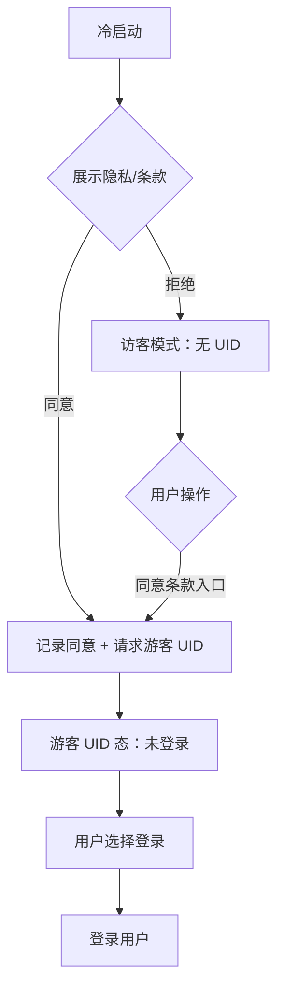
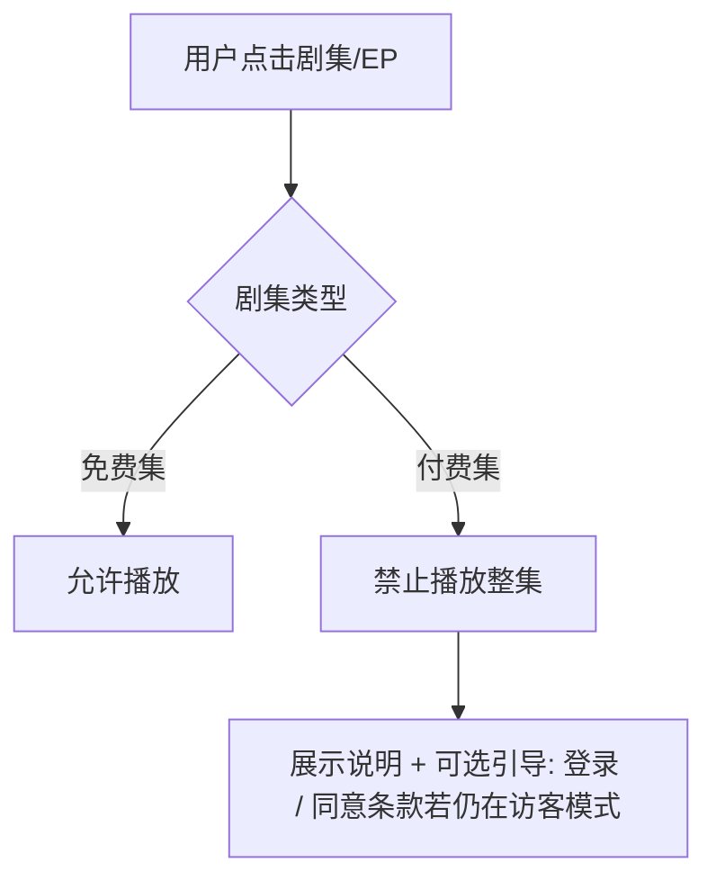
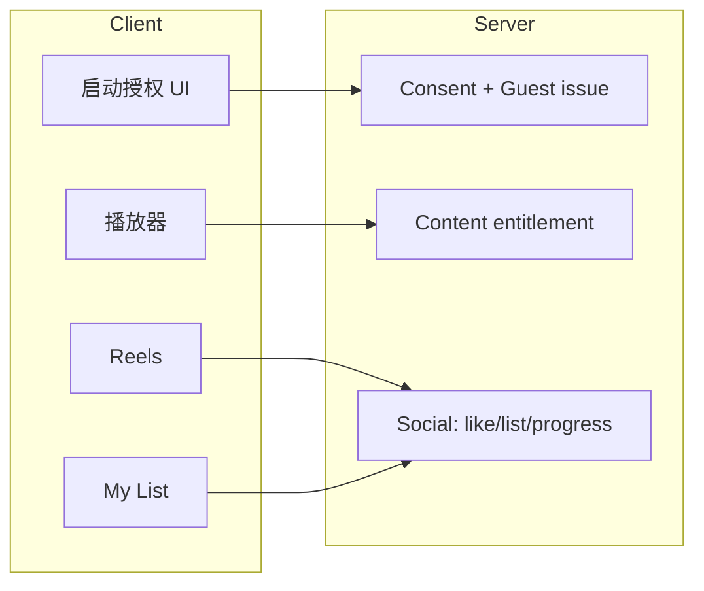

# FlareFlow · 访客模式与游客身份 — 产品需求文档（PRD）

## 1. 产品概述

### 1.1 背景

FlareFlow 为出海短剧产品，拟满足**公司上市合规**对用户同意、数据最小化及身份可追溯的要求。当前设计（Figma `FF-V1.7.5`）已具备底部四 Tab：**Discover**、**Reels**、**My List**、**Profile**，需在**不混淆概念**的前提下引入：

- **访客模式（Visitor Mode）**：用户**未同意**隐私政策（及服务条款，若一并展示）时的运行态；**不分配任何 UID**（含游客 UID）；采集与 SDK 行为遵循「最小化」红线。
- **游客身份（Guest with UID）**：用户**已同意**隐私政策但**未完成账号登录**；服务端分配**游客 UID**；在条款披露范围内开放完整对客能力（点赞、列表、播放进度等）。
- **登录用户**：完成注册/登录后的正式账号体系；**充值与订阅购买**仅在此群体完成。

### 1.2 问题陈述

1. 口语中「访客」与「游客」易混用，导致研发/合规对「是否可有 UID、是否可打点」理解不一致。
2. 首次拒绝隐私条款的用户仍需能使用 App 核心浏览能力，但不能触碰未同意之数据处理。
3. Profile 等页面若展示「伪 UID」或开放 Top-up，与合规及「未登录不充值」冲突。

### 1.3 目标

| 目标 | 可验收指标（业务侧） |
|------|----------------------|
| 概念对齐 | PRD 与隐私政策中「访客模式 / 游客 UID / 登录用户」**术语一致**；研发评审无歧义项 |
| 合规路径 | 首次启动**先**完成隐私/服务条款授权流；拒绝可进入访客模式；同意后可下发游客 UID |
| 体验 | Discover / Reels 主路径在访客模式下**可浏览、免费集可播放**；同意条款后互动与列表**可用** |
| 商业化边界 | **已登录**方可完成真实货币充值；访客须能经**多入口同意条款**进入游客 UID 后再登录充值 |

### 1.4 非目标

- 本需求**不包含**国内「青少年模式」专项（产品定位为出海且无该强制要求）。
- 本 PRD **不规定**具体支付渠道、定价、会员 SKU（由商业化专项 PRD 覆盖）。
- **不写入**具体 HTTP 路径、错误码命名、DDL（见 PM 边界说明第 8 章）。

### 1.5 决策上下文（唯一规则源摘要）

**身份与 UID（详见第 5.1 节）**

- 访客模式：**无 UID**。
- 同意条款 + 未登录：**有游客 UID**。
- 登录：**正式账号 UID**（与游客 UID 的合并策略见 **§10.1**）。

**采集（访客模式）**

- 不收集：设备号、广告 ID、行为日志（具体定义以法务书面为准；PRD 默认包含常见埋点/分析事件）。

**内容**

- 免费集：访客模式与游客 UID 均可播放。
- 付费集：**不可播放**（门闸与解锁引导见第 5.3 节）。

**充值**

- 仅**已登录**用户可完成 Top-up / 订阅购买闭环。
- **转化依赖**：用户若处于访客模式（无 UID），须先经**任一「隐私条款同意」入口**（见 **5.2.13**）取得**游客 UID**后，再**登录**方可充值；产品须在 UI 上保证该路径可发现，避免「拒绝首启后永久无法充值」。

### 1.6 文档定位（研发免追问 PM）

本 PRD 目标读者为**研发与 QA**：实现本需求时，**业务规则、状态、接口意图、鉴权方式、默认策略**以本文为准；**不要求**产品经理再逐条澄清交互逻辑。若实现中发现与**已上线隐私政策**冲突，以法务书面为准并走变更单。

**研发自检（合入前）**：

1. 已读 **§5.0 能力矩阵** 与 **§3.3 状态转移**，代码中身份枚举与之一致。
2. 所有写接口已按 **§8.3.0** 携带正确鉴权载体；访客模式**不**发 guest 写接口。
3. **§8.5 SDK 开关表** 在访客模式路径已关闭/未初始化。
4. Gherkin（各 5.x.12 + §5.2.14）在 CI 或手工回归中有对应用例。

---

## 2. 目标用户与使用场景

### 2.1 目标用户

- **合规敏感新用户**：首次安装，希望先了解产品再决定是否同意数据处理。
- **拒绝条款但仍想浏览者**：暂时不同意隐私政策，仅接受最小功能。
- **同意条款但暂不注册者**：愿意被分配游客 UID，以使用收藏、进度、点赞等需持久化身份的功能。

### 2.2 使用场景（≥3）

**场景 A — 首次启动拒绝隐私**

1. 用户冷启动 App → 系统展示隐私政策（+ 服务条款若适用）与「同意 / 拒绝」。
2. 用户点「拒绝」→ 进入**访客模式**（无 UID）。
3. 用户浏览 Discover、进入 Reels 播放**免费集**；点付费集 → 提示不可播放并可引导「同意条款」或「登录」（文案见第 6 章）。

**场景 B — 首次同意但未登录**

1. 用户点「同意」→ 客户端记录同意事实 → 后端下发**游客 UID**。
2. 用户在 Reels 点赞、将剧加入 My List、播放进度在多会话间按产品设计同步。
3. 用户打开 Profile：展示游客身份与「登录」入口；**Top-up 不可完成**。

**场景 C — 访客模式中途同意**

1. 用户处于访客模式（无 UID）→ 在设置或拦截弹窗中点「同意隐私政策」。
2. 同意后获得游客 UID → 若本地曾有临时态（若有）按 **§10.1** 在登录时合并；无登录则无合并。

---

## 3. 核心用户动线

### 3.1 主流程（身份状态）



### 3.2 播放与付费集分支



### 3.3 身份状态转移表（事件 → 下一状态）

**主状态枚举**（客户端全局单一来源）：`VISITOR` | `GUEST` | `LOGGED_IN`。

| # | 当前状态 | 事件 | 下一状态 | 客户端必做 | 服务端必做（业务） |
|---|----------|------|----------|------------|---------------------|
| T1 | —（首装） | 冷启动且未完成首启决策 | `VISITOR` 或 `GUEST` | 展示 5.2 弹窗；拒绝→落 `VISITOR` | 拒绝时不创建 guest；同意→签发 guest |
| T2 | `VISITOR` | 任一入口完成同意且签发成功（5.2.13） | `GUEST` | 持久化 `guest_session_token` + `consent` 元数据 | 创建/返回 guest_uid、会话 token |
| T3 | `VISITOR` | 用户点次要「Log in」并完成登录成功 | `LOGGED_IN` | 无 `guest_session_token` 则 **无合并** | 无 guest 数据 |
| T3a | `VISITOR` | 用户点「Log in」但未完成登录（返回） | `VISITOR` | 无状态变更 | — |
| T4 | `GUEST` | 登录成功 | `LOGGED_IN` | 清除或轮换 guest 本地展示；携带账号会话 | **合并**见 §10.1 |
| T5 | `LOGGED_IN` | 用户主动登出 | `VISITOR` | 清除账号会话与本地敏感缓存；**不**自动恢复 guest | 会话失效 |
| T6 | `GUEST` | 用户在设置「撤回同意」（若入口存在） | `VISITOR` | 清除 consent + guest token | **吊销** guest 会话；列表类接口对原 token 返回未授权或空 |
| T7 | `GUEST` | `guest_session_token` 过期或吊销后用户继续使用 | `VISITOR` | Toast 提示需重新同意；清 guest 本地态 | 可选：重新签发策略由研发定，**默认**需重新走同意流 |

> **说明**：`LOGGED_IN` 下 **不再**向业务 API 携带 `guest_uid` 作为主身份；合并完成后以 `account_uid` 为准。

---

## 4. 功能清单与视觉输入

### 4.1 功能清单（树状 + 优先级）

| 优先级 | 模块 | 说明 |
|--------|------|------|
| 🔴 | 身份分层与状态机 | 访客模式 / 游客 UID / 登录三态及互斥规则 |
| 🔴 | 首次启动隐私授权 | 同意、拒绝、再次入口 |
| 🔴 | 隐私条款同意多入口露出 | 访客模式全链路可发现「同意」路径，与首启弹窗**同一套**授权 UI |
| 🔴 | 播放门闸 | 免费集 / 付费集 |
| 🔴 | Reels 互动 | 点赞、列表按钮在访客模式与游客 UID 下的差异 |
| 🔴 | My List | 收藏与历史在游客 UID 下可用 |
| 🔴 | Profile | 无伪 UID；访客主路径为**隐私授权**（非登录）；游客 UID 后 Top-up 门闸、登录 |
| 🟡 | 设置-隐私中心 | 撤回同意、再次展示条款（与法务政策一致） |

### 4.2 关键页面 ASCII 线框（Before / After）

#### 4.2.1 Profile — Before（易误导）

```
+------------------------------------------+
|  [头像]  Guest                    [Login]|
|           UID: 0000 0000  [copy]       |  ← 伪 UID 与可点 Top-up 并存，与访客定义冲突
|  [ Top Up ]   Coins 0   Bonus 0        |
|  VIP banner [Go]                        |
+------------------------------------------+
```

#### 4.2.2 Profile — After（访客模式：无 UID）

```
+------------------------------------------+
|  [头像]  Visitor              Log in ·· |  ← Log in 仅次要入口（弱样式），非主 CTA
|  未同意隐私政策 · 浏览模式              |
|  [ Agree to Privacy Policy ]  （主按钮） |  ← 点击 = 弹出与首启一致的隐私授权弹窗
|  VIP / Wallet 区：点整块 → 同上弹窗      |  ← 访客下不弹「请登录充值」
+------------------------------------------+
```

#### 4.2.3 Profile — After（游客 UID：未登录）

```
+------------------------------------------+
|  [头像]  Guest                          |
|  Guest ID: FF-GUEST-xxxxxxxx   [copy]  |  ← 真实游客 UID，非占位符
|  [ Login to recharge ]                  |  ← Top-up 替换为登录引导（不可进入收银台）
|  VIP banner [See plans] → 登录拦截      |
+------------------------------------------+
```

#### 4.2.4 首次启动 — 隐私全屏/半屏（示意）

```
+------------------------------------------+
|  Welcome to FlareFlow                    |
|  [隐私政策摘要 2-3 行...]               |
|  [ ] I agree to Privacy Policy & Terms  |
|  [ Agree and continue ]  [ Not now ]    |
+------------------------------------------+
```

#### 4.2.5 Discover — 访客模式露出条（与 E4 一致）

```
+------------------------------------------+
|  FlareFlow                    9:41  🔋  |
|  ┌────────────────────────────────────┐|
|  │ 🔓 Unlock full experience — Tap     │  ← 仅 VISITOR 显示；点按 → 5.2 授权弹窗
|  └────────────────────────────────────┘|
|  [ 轮播 Hero / Play Now ]                |
|  单排横图 …                              |
+------------------------------------------+
```

### 4.3 视觉系统与 UI 提示词（UI / HTML 渲染用）

#### 4.3.0 视觉系统（全局）

- **平台**：移动端 iOS / Android 原生。
- **风格**：深色消费娱乐、高对比、金色/琥珀主 CTA（与现有 FlareFlow 品牌一致）；卡片 `#1F2937`，背景接近 `#111111`。
- **模式**：Dark。
- **密度**：主按钮高度 ≥ 44pt 可点区域；列表行清晰分隔。

#### 4.3.1 Discover（英文提示词片段）

```
UI design rendering of FlareFlow Discover home screen, mobile app screenshot.
Design style: modern streaming app, cinematic dark mode, gold/amber accent CTA.
Color scheme: Primary #EAB308, Background #111111, Cards #1F2937, Text #F9FAFB
Mode: Dark
Layout: top logo, hero carousel with "Play Now", horizontal poster rows, bottom tab bar (Discover active).
Quality: high-fidelity UI rendering, no watermark
```

#### 4.3.2 Reels

```
UI design rendering of FlareFlow vertical Reels player, full-bleed video, right-side like/VIP/stack icons, bottom title and EP strip with lock on paid episode, dark mode gold accents.
```

#### 4.3.3 Profile（访客 / 游客 UID 两态）

```
UI design rendering of FlareFlow Profile screen variants side by side: (1) Visitor mode — primary "Agree to Privacy Policy" and VIP/wallet tap opens same consent modal as onboarding, weak secondary Log in; (2) Guest with UID showing Guest ID and "Login to recharge" replacing Top Up. Discover strip "Unlock full experience" for visitors.
```

---

## 5. 功能详细描述

### 5.0 三态能力矩阵与鉴权（研发真值表）

#### 5.0.1 能力矩阵（功能 × 身份）

| 能力 | VISITOR 访客模式 | GUEST 游客 UID（未登录） | LOGGED_IN 已登录 |
|------|------------------|---------------------------|------------------|
| 浏览 Discover / Reels 列表 | ✅ | ✅ | ✅ |
| 播放 **免费集** 正片 | ✅ | ✅ | ✅ |
| 播放 **付费集** 正片 | ❌（门闸 5.3） | ❌ | 遵循会员/单点等**既有商业化规则**（本 PRD 不定义收银台） |
| 点赞写入服务端 | ❌（点击走同意流 5.4） | ✅ | ✅ |
| My List 读写服务端 | ❌（空态 + 同意 5.5） | ✅ | ✅ |
| 播放进度跨设备同步 | ❌ | ✅ | ✅ |
| 真实货币 Top-up / 订阅 IAP | ❌ | ❌ | ✅ |
| 展示钱包数值 | ❌（占位卡走同意） | ❌（整区折叠或静态文案 5.6） | ✅ |
| 归因 / 广告 ID / 行为分析 SDK | ❌ 关闭或未初始化 | ✅ 允许（须已 consent，见隐私政策） | ✅ |

#### 5.0.2 鉴权载体（请求侧业务约定）

| 身份 | HTTP 层载体（业务名，研发可改名） | 取值 | 禁止 |
|------|-----------------------------------|------|------|
| VISITOR | 无 | 不调需身份持久化的写接口；只读内容接口可匿名 | 携带 guest token / 伪造 UID |
| GUEST | `Guest-Session-Token`（或等价 Header） | 同意成功后下发的 **opaque session string** | 与 `Authorization` 同时使用于同一写请求（二选一） |
| LOGGED_IN | `Authorization: Bearer <access_token>` | 账号体系既有 token | 业务写请求仅用 guest token |

⚠️ **研发深化**：Header 精确名、刷新、rotation、与 CDN 鉴权关系。

#### 5.0.3 播放与写接口的硬门槛（防客户端绕过）

- **起播 / 试看接口**：服务端必须校验 `episode_pay_type`；若为 `paid` 且当前身份**无**有效会员/单点权益（本 PRD不展开权益模型），**不得**返回可播放的正片流地址。
- **点赞 / My List / 进度写接口**：无 `Guest-Session-Token` 或 Bearer 时 **409/403**（具体码研发定），用户文案见 **8.3.1**。

---

### 5.1 🔴 身份分层与数据采集边界

**目标读者**：前端 / 后端 / 合规 / QA

#### 5.1.1 功能说明

统一定义三种身份及数据采集边界，避免与「访客」「游客」口语混淆。

#### 5.1.2 触发条件

App 任意时刻均处于且仅处于一种主状态：`VISITOR`（访客模式）| `GUEST`（游客 UID，未登录）| `LOGGED_IN`（已登录）。与 **§5.0** 矩阵一致。

#### 5.1.3 入口位置

全局：启动、登出、撤回同意后均可能切换状态。

#### 5.1.4 页面结构

逻辑层状态机 + 客户端本地持久化（同意标记、游客 token 等，实现由研发深化）。

#### 5.1.5 UI 示意（状态与展示）

```
访客模式:     badge "Visitor" | 无 UID 展示
游客UID:      badge "Guest"   | Guest ID: FF-GUEST-xxxx
登录用户:     用户名/头像      | Account ID（体系由账号服务定义）
```

#### 5.1.6 控件清单（6 项必填 × 控件数 — 摘要表）

| # | 控件 | 默认可点 | 点击后 | 重复点击 | 成功去路 | 失败提示 |
|---|------|----------|--------|----------|----------|----------|
| 1 | 「同意隐私政策」（访客模式） | 是 | 打开条款勾选流程 | 是 | 进入游客 UID 态 | 网络失败 toast |
| 2 | 「登录」 | 是 | 登录页 | 是 | 登录成功 | 登录失败见 8.3.1 |

#### 5.1.7 弹窗规则

全屏/半屏隐私授权见第 5.2 节；本模块不重复定义文案。

#### 5.1.8 状态清单

- 访客模式 / 游客 UID / 登录：三态互斥；切换时 UI 全局刷新依赖数据（Profile、Reels 侧栏等）。

#### 5.1.9 异常处理

- 同意条款成功但游客 UID 下发失败：保留访客模式 + 可重试 + 明确错误文案（8.3.1）。

#### 5.1.10 联动规则

- 所有需持久化用户数据的接口必须携带 **§5.0.2** 所列鉴权载体之一；`VISITOR` **不得**静默创建 UID。

#### 5.1.11 数据规范（业务字段）

| 字段（业务语义） | 类型 | 必填 | 说明 |
|------------------|------|------|------|
| app_identity_state | enum | 是 | `VISITOR` / `GUEST` / `LOGGED_IN`，与 §5.0 一致 |
| guest_uid | string | 仅 `GUEST` | 服务端稳定用户标识；**不在** `VISITOR` 出现；`LOGGED_IN` 合并完成后客户端**不再展示** |
| guest_session_token | string | 仅 `GUEST` | Opaque，用于 `Guest-Session-Token`；吊销后即失效 |
| consent_privacy_version | string | `GUEST` 起必填 | 用户同意的隐私政策版本号 |
| consent_at | datetime | `GUEST` 起必填 | 同意时间（UTC 或带时区，研发定） |
| account_uid | string | 仅 `LOGGED_IN` | 正式账号主键 |

⚠️ **研发深化**：存储键名、加密、Keychain/Keystore、表结构。

#### 5.1.12 验收标准（5.1.6 Gherkin）

```gherkin
Scenario: 访客模式不创建 UID
  Given 用户处于 VISITOR 状态
  When 客户端读取身份与持久化存储
  Then 不得存在 guest_uid 与 guest_session_token
  And 不得存在有效登录会话（LOGGED_IN）

Scenario: 同意后下发游客 UID
  Given 用户点击同意隐私政策且请求成功
  When 客户端收到成功响应
  Then app_identity_state 为 GUEST
  Then 应持久化 guest_uid 与 guest_session_token 且 Profile 展示可复制 Guest ID
```

---

### 5.2 🔴 首次启动：隐私条款授权

**目标读者**：前端 / 后端 / QA

#### 5.2.1 功能说明

首次冷启动展示隐私政策（及服务条款，若产品要求一并同意）；用户可选择同意或拒绝。

#### 5.2.2 触发条件

- 首次安装后第一次启动。
- 用户从访客模式点击「同意隐私政策」入口。

#### 5.2.3 入口位置

冷启动首屏；设置页「隐私政策」卡片。

#### 5.2.4 页面结构

全屏或不可跳过的模态（产品可选半屏，但必须**显著**且可滚动阅读全文链接）。

#### 5.2.5 UI 示意（ASCII）

见 **4.2.4**。

#### 5.2.6 控件清单

<a id="sec-5-2-6-c1"></a>

| # | 控件 | 默认可点 | 点击后 | 重复点击 | 成功去路 | 失败提示 |
|---|------|----------|--------|----------|----------|----------|
| c1 | `Agree and continue` | 依赖勾选 | 提交同意 | 防抖 | 游客 UID 态 + 进首页 | 见 8.3.1 |
| c2 | `Not now` | 是 | 进入访客模式 | 是 | Discover 默认 Tab | — |
| c3 | 隐私政策链接 | 是 | 内嵌 WebView 或外链 | 是 | 返回授权页 | 打开失败 toast |

#### 5.2.7 弹窗规则 — 隐私授权主弹窗

| 项 | 内容 |
|----|------|
| 标题 | Welcome to FlareFlow |
| 正文 | 摘要 + 全文链接 |
| 按钮 | Agree and continue / Not now |
| 点取消（Not now） | 访客模式，无 UID |
| 点确认（Agree） | 校验勾选 → 请求游客 UID |

#### 5.2.8 状态清单

未勾选时主按钮置灰；网络请求中按钮 loading。

#### 5.2.9 异常

网络断开、后端 5xx：toast + 保留在当前页。

#### 5.2.10 联动

同意后需刷新全局依赖 UID 的模块（My List、点赞状态等）。

#### 5.2.11 数据规范

同 5.1.11；另需记录 `terms_version`（若展示服务条款）。

#### 5.2.12 验收标准

```gherkin
Scenario: 拒绝进入访客模式
  Given 用户在首次隐私弹窗
  When 用户点击 Not now
  Then 进入访客模式且 Profile 不展示任何 UID

Scenario: 同意进入游客 UID
  Given 用户勾选同意且点击 Agree and continue
  When 后端成功返回 guest_uid
  Then Profile 展示 Guest ID 可复制
```

#### 5.2.13 隐私条款同意入口（全局露出）

**目标**：访客模式用户在任何常用路径上都能**再次发现**「同意隐私政策」入口，避免因首启拒绝后无处同意而导致**永远无法进入游客 UID → 无法登录充值**的转化断点。

**统一规则**：以下入口点击后，均拉起**与 5.2.7 主弹窗同一套**的隐私条款授权 UI（全屏或 Modal，由 UI 稿定；**文案、勾选、Agree / Not now 逻辑与 5.2 一致**），**不得**在访客模式下以「请先登录」替代该授权。

| # | 入口位置 | 露出形态（PM 草稿） | 访客模式点击后 |
|---|-----------|----------------------|----------------|
| E1 | 冷启动首屏 | 全屏/强模态 | 同 5.2（已定义） |
| E2 | **Profile** | 主按钮 **Agree to Privacy Policy** + 副文案 | 打开隐私授权 |
| E3 | **Profile** | VIP 横幅 / 钱包占位整卡（无 Top-up 收银台） | 打开隐私授权（**不**弹登录） |
| E4 | **Discover** | 顶部轻条或轮播下方 pill：「Unlock full experience」 | 打开隐私授权 |
| E5 | **My List** 空态 | 主按钮 **Agree**（与 5.5 一致） | 打开隐私授权 |
| E6 | **Reels** 点赞/列表 | 半屏（5.4.7）内容复用 5.2 勾选逻辑 | 打开/半屏隐私授权 |
| E7 | **付费集门闸**（5.3.7） | 第三按钮 **Review privacy policy** | 打开隐私授权 |
| E8 | **Settings** | 「Privacy & terms」行 + 访客可见 **Agree to continue** | 打开隐私授权 |
| E9 | **Discover 底部条（可选功能开关 `feature.discover_consent_strip`）** | 与 E4 二选一或并存由产品配置；若启用：每位 `VISITOR` **每自然日最多展示 1 次**；用户点关闭后 **7 个自然日内**不再展示该条（客户端存 `last_dismissed_at`） | 点条体 → 打开隐私授权；点关闭 → 仅关闭条 |

**实现约束**：E1–E8 为 **P0 必做**；E9 为 **P1 可配置**，默认 **关闭**（避免过度打扰）；若关闭 E9，E4 条为 Discover 唯一常驻露出（仍满足「多入口」）。

**组件复用**：所有入口必须调用同一 **`ConsentFlowCoordinator`**（逻辑名）：入参 `entry_point` ∈ {cold_start, profile_cta, profile_vip, discover_strip, mylist_empty, reels_sheet, paid_gate, settings}，便于埋点（若允许）与调试；**访客模式该 coordinator 不得路由到登录页替代勾选**。

#### 5.2.14 验收标准（多入口）

```gherkin
Scenario: Profile 访客点 VIP 露出隐私授权
  Given 用户处于访客模式且在 Profile
  When 用户点击 VIP 或钱包占位区
  Then 展示与首启一致的隐私条款授权弹窗
  And 不展示「请先登录以同意条款」类替代文案

Scenario: Discover 露出条
  Given 用户处于访客模式且在 Discover
  When 用户点击「Unlock full experience」条
  Then 打开隐私条款授权弹窗
```

---

### 5.3 🔴 播放：免费集与付费集

**目标读者**：前端 / 后端 / QA

#### 5.3.1 功能说明

对任意身份，按剧集商务属性区分免费/付费集；访客模式与游客 UID 在「是否可播」上规则一致。

#### 5.3.2 触发条件

用户点击海报、「Play Now」、Reels 内 EP 切换。

#### 5.3.3 入口

Discover、Reels、详情页。

#### 5.3.4 页面结构

播放器内门闸 overlay 或 EP 列表锁标（沿用现有 FF-V1.7.5 视觉）。

#### 5.3.5 UI 示意

```
免费集: [ EP.3 ▶ 可点 ]
付费集: [ EP.8 🔒 ] 点按 → 门闸 sheet
```

#### 5.3.6 控件清单

<a id="sec-5-3-6-c1"></a>

| # | 控件 | 默认可点 | 点击后 | 成功去路 | 失败提示 |
|---|------|----------|--------|----------|----------|
| c1 | 付费集 EP | 是（可点门闸） | 弹出说明 | 留在门闸 | — |
| c2 | 免费集 EP | 是 | 起播 | 播放器播放 | 起播失败 toast |

#### 5.3.7 弹窗 — 付费集门闸 Sheet

| 项 | 内容 |
|----|------|
| 标题 | This episode is for VIP / paid |
| 正文 | 简短说明 |
| 主按钮 | **VISITOR**：**Agree to Privacy Policy**（打开 5.2 授权）；**GUEST**：**Log in**（主）+ 次要 **Learn about VIP / membership**（文案可 A/B，主按钮必须先进登录以绑定支付）；**LOGGED_IN**：由商业化（跳转会员页 / IAP） |
| 次按钮 | Close |
| 第三按钮（访客模式必选） | **Review privacy policy** → 打开隐私授权（同 5.2） |

访客模式下**禁止**将主按钮仅写为「请先登录」而遮挡隐私同意路径；若展示「登录」，须与「同意隐私政策」并列或次级，且语义上登录**不替代** consent。

#### 5.3.8–5.3.10

含加载失败、版权地区不可用（若有）——统一 toast + 可重试（文案 8.3.1）。

#### 5.3.11 数据规范

| 字段 | 说明 |
|------|------|
| episode_pay_type | enum: free / paid（业务枚举，与 CMS 对齐） |

#### 5.3.12 验收标准

```gherkin
Scenario: 免费集可播
  Given 当前 EP 为 free
  When 用户点击播放
  Then 播放器开始播放且不计费

Scenario: 付费集不可播
  Given 当前 EP 为 paid
  When 用户点击播放
  Then 展示付费门闸且不开始整集播放
```

---

### 5.4 🔴 Reels：点赞与列表

**目标读者**：前端 / 后端 / QA

#### 5.4.1 功能说明

- **访客模式**：点赞、加列表按钮**可点**，首次点击打开**隐私同意**半屏（目标：获取同意并发游客 UID），**不写入**需 UID 的远端关系；不发送行为日志（访客模式定义）。
- **游客 UID**：点赞、加列表**全开**，数据持久化到后端（在条款披露范围内）。

#### 5.4.2 触发条件

用户点击心形、列表图标。

#### 5.4.3 入口

Reels 右侧交互栏。

#### 5.4.4 页面结构

保持现有竖屏布局；访客模式下半屏同意组件复用 5.2 逻辑。

#### 5.4.5 UI 示意

```
访客模式:  [♡] [☆]  → 点 ♡ → Bottom sheet（标题 Save likes & lists，见 5.4.7）
游客UID:   [♡ 30.8K] 可点亮/取消
```

#### 5.4.6 控件清单

<a id="sec-5-4-6-c1"></a>

| # | 控件 | 访客模式 | 游客 UID |
|---|------|----------|----------|
| c1 | Like | 点击 → 同意半屏 | 切换喜欢状态 + 调后端 |
| c2 | Add to list | 点击 → 同意半屏 | 写入 My List |

#### 5.4.7 弹窗

半屏标题：**Save likes & lists**；副标题：需同意隐私政策以创建访客档案；按钮 **Agree and continue** / **Not now**（与 5.2.7 勾选逻辑一致，非「仅登录」）。

#### 5.4.8 状态

已喜欢高亮；请求中 loading。

#### 5.4.9 异常

后端失败：toast「Couldn’t save, try again」。

#### 5.4.10 联动

与 My List 列表实时同步（游客 UID / 登录用户）。

#### 5.4.11 数据规范

| 字段 | 说明 |
|------|------|
| liked | boolean |
| in_my_list | boolean |

#### 5.4.12 验收标准

```gherkin
Scenario: 访客点 Like 打开同意
  Given 访客模式
  When 用户点击 Like
  Then 展示隐私同意半屏且不调用点赞写入接口

Scenario: 游客点赞
  Given 游客 UID
  When 用户点击 Like
  Then 调用后端且心形变为已喜欢状态
```

---

### 5.5 🔴 My List（收藏 / 历史）

**目标读者**：前端 / 后端 / QA

#### 5.5.1 功能说明

- **访客模式**：可进入 Tab，列表为空 + 「同意条款以同步列表」占位；**不展示任何来自云端的收藏/历史**（无 token 不可拉取）。
- **游客 UID**：Favorites / History **全开**，与后端同步。

#### 5.5.2–5.5.4

入口为底部 Tab **My List**；布局沿用三列网格。

#### 5.5.5 UI 示意（访客）

```
+------------------------------------------+
| My List                    [edit 灰置]  |
| [ Favorites ] [ History ]               |
|  (空态插画)                             |
|  Agree to Privacy Policy to save shows  |
|  [ Agree ]                              |
+------------------------------------------+
```

#### 5.5.6 控件清单

<a id="sec-5-5-6-c1"></a>

| # | 控件 | 访客模式 | 游客 UID |
|---|------|----------|----------|
| c1 | Agree | 是 | — |
| c2 | 编辑 | 否（灰） | 是 |

#### 5.5.7–5.5.10

空态、加载骨架、网络失败与 5.4 一致。

#### 5.5.11 数据规范

列表项含 `drama_id` / `title` / `poster` / `last_ep` / `updated_at`（业务字段）。

#### 5.5.12 验收标准

```gherkin
Scenario: 游客 UID 可见收藏
  Given 游客 UID 且已收藏剧 A
  When 用户打开 My List Favorites
  Then 展示剧 A 海报与标题
```

---

### 5.6 🔴 Profile：访客以隐私授权为主路径，钱包 / VIP / 登录

**目标读者**：前端 / QA / 商业化

#### 5.6.1 功能说明

- **访客模式**：
  - **不展示 UID**；**不展示可进入收银台的 Top-up**。
  - **主路径不是「去登录」**：用户点击 Profile 主 CTA、VIP 横幅、钱包占位区等（见 **5.2.13 E2/E3**），一律弹出**与首启一致的隐私条款授权弹窗**（5.2.7），用于进入**游客 UID**。
  - **登录**仅作为**次要入口**（如顶栏弱样式 `Log in`），满足「已有账号、暂不同意」等边缘场景；**不得**用登录弹窗**替代**隐私授权。
- **游客 UID（未登录）**：展示 Guest ID；Top-up 区域为 **Login to recharge**（跳转登录，不可进入收银台）；VIP「Go」若通往购买 → **登录拦截**（5.6.7 第二套弹窗）。
- **登录用户**：展示账号信息 + 正常钱包与 VIP 入口（由既有版本承接）。

#### 5.6.2–5.6.5

见 **4.2.2 / 4.2.3** ASCII；访客态 VIP/钱包点击行为以 **5.2.13** 为准。

#### 5.6.6 控件清单

<a id="sec-5-6-6-c1"></a>

| # | 控件 | 访客模式 | 游客 UID | 登录 |
|---|------|----------|----------|------|
| c1 | 主 CTA「同意隐私政策」 | 是 → **隐私授权弹窗**（5.2） | — | — |
| c2 | VIP / 钱包占位区 | 是 → **隐私授权弹窗**（**禁止**仅弹登录） | 登录拦截（5.6.7-2） | 正常 |
| c3 | Top-up / Login to recharge | 隐藏真实 Top-up | 显示 **Login to recharge** | Top-up |
| c4 | Log in（次要） | 是 → 登录页 | 是 | 账号管理 |

#### 5.6.7 弹窗

**（1）访客模式 — 隐私条款授权**  
与 **5.2.7** 一致：标题 / 正文 / 勾选 / **Agree and continue** / **Not now**；**不得**替换为「Login to accept」类模糊 consent。

**（2）游客 UID 未登录 — 充值拦截**  
标题 **Login required**；正文说明充值需登录；主按钮 **Log in**。

#### 5.6.8–5.6.10

余额展示：访客不展示数字钱包；游客 UID 可展示 0 但不可充值（或整区折叠，由 UI 稿择一，默认**整区折叠为一句说明**以减少误解）。

#### 5.6.11 数据规范

`wallet_balance_coins` 等仅登录用户拉取；游客 UID **不请求**真实钱包接口（或仅展示静态文案，研发择一）。

#### 5.6.12 验收标准

```gherkin
Scenario: 访客 Profile 点 VIP 弹出隐私授权而非登录
  Given 用户处于访客模式且在 Profile
  When 用户点击 VIP 横幅或钱包占位区
  Then 展示与首启一致的隐私条款授权弹窗
  And 不展示仅含「请登录」且无同意勾选的弹窗

Scenario: 游客 UID 无法进入充值
  Given 游客 UID 用户在 Profile
  When 用户点击 Login to recharge
  Then 进入登录页且未打开收银台
```

---

## 6. 文案规范（终端用户可见英文为主）

| Key | Visitor | Guest UID | Logged-in |
|-----|---------|-----------|-----------|
| profile_title | Visitor | Guest | 用户名 |
| profile_subtitle | Browsing without personalization account | Guest ID copied / tap to copy | 账户邮箱/手机掩码 |
| agree_cta | Agree to Privacy Policy | — | — |
| login_cta | Log in | Log in | Account |
| recharge_blocked | — | Log in to recharge | （既有） |
| paid_ep_sheet_title | Episode locked | 同左 | 可改为会员文案 |
| discover_consent_pill | Unlock full experience | — | — |
| settings_privacy_cta | Review Privacy Policy | — | — |
| paid_gate_agree | Agree to Privacy Policy | — | — |

---

## 7. 非功能性需求

| 类别 | 要求 |
|------|------|
| 合规 | 访客模式 SDK 清单经法务签字；隐私政策披露游客 UID 生成时机与用途 |
| 性能 | 同意条款请求 P95 < 2s（弱网降级提示） |
| 安全 | 游客 token 防伪造、可吊销；登录后 merge 策略防刷 |
| 可观测 | **访客模式**禁止行为日志；监控仅聚合技术健康度（不含用户标识，定义由研发与法务确认） |

---

## 8. 影响范围矩阵

### 8.1 模块 × 端总览

| 模块 | 优先级 | 前端 | 后端 | 数据库 | 第三方 | 工作量 |
|------|----------|------|------|--------|--------|--------|
| 身份状态机 | 🔴 | 改 | 改 | 可能增 | SDK 配置 | 中 |
| 隐私授权（首启 + 多入口 5.2.13） | 🔴 | 改 | 改 | 可能增 | — | 中 |
| 播放器门闸 | 🔴 | 改 | 读 | — | CMS | 小 |
| Reels 互动 | 🔴 | 改 | 改 | 可能增 | — | 中 |
| My List | 🔴 | 改 | 改 | 可能增 | — | 中 |
| Profile | 🔴 | 改 | 读 | — | — | 小 |

### 8.2 前端影响详情（PM 草稿）

- **启动流程**：新增隐私授权路由层；拒绝路径落 Discover。
- **Discover / Reels / My List / Profile**：按三态改按钮显隐、门闸、空态。
- **隐私同意多入口**：Discover 条、Profile 主/VIP/钱包区、My List 空态、Reels 半屏、付费门闸、Settings（见 **5.2.13**），均复用同一授权 UI。
- **SDK**：访客模式关闭归因/广告/分析（清单另表）。

⚠️ **研发深化**：组件树、路由表、状态管理。

### 8.3 后端影响详情（PM 草稿）

- 新增或扩展：**同意条款 + 签发游客 UID**、**游客会话校验与吊销**、**点赞 / My List / 进度** 在 `GUEST` 下的持久化、**登录合并**（§10.1）。
- 修改：**起播/试看鉴权**必须校验 `episode_pay_type` + 权益；所有写接口校验 **§5.0.2** 鉴权。

#### 8.3.0 业务接口契约清单（无 URL — 研发映射到具体路由）

> 每张表一行「意图」；HTTP 方法、路径、错误体由研发在技术 spec 定义。列 **幂等** 指研发实现时是否需 `Idempotency-Key`（建议写接口带）。

| 接口意图 | 方法语义 | 鉴权 | 请求关键业务字段 | 响应关键业务字段 | 幂等 |
|----------|----------|------|------------------|------------------|------|
| 提交隐私同意并签发游客 | POST 语义 | 无或设备匿名层（**不得**含持久 UID） | `privacy_version`, `terms_version?`, `locale`, `platform` | `guest_uid`, `guest_session_token`, `guest_session_expires_at` | 是 |
| 刷新游客会话 | POST 语义 | Guest-Session-Token | `guest_session_token` | 新 token 对或 401 | 否 |
| 吊销游客（撤回同意 / 登出预处理） | POST 语义 | Guest-Session-Token 或管理态 | `reason` | `ok` | 是 |
| 点赞切换 | POST 语义 | Guest 或 Bearer | `drama_id`, `liked` | `like_count`, `liked` | 是 |
| My List 写入 | POST 语义 | Guest 或 Bearer | `drama_id`, `list_type` enum `favorite|history`, `op` enum `add|remove` | `ok`, `updated_at` | 是 |
| 播放进度上报 | PUT 语义 | Guest 或 Bearer | `drama_id`, `episode_id`, `progress_sec` | `ok`, `updated_at` | 是 |
| 登录后合并游客数据 | POST 语义 | Bearer + body 带 `guest_session_token` | `guest_session_token` | `merged_counts` 摘要 | 是 |
| 内容/起播鉴权 | GET 语义 | 可选 Guest/Bearer/无 | `episode_id` | `episode_pay_type`, `playable`, `manifest_url?` | 读接口 |

### 8.3.1 错误场景 + 用户提示文案（PM 草稿）

| 错误场景 | 用户看到的提示 | HTTP 大致范围 |
|----------|----------------|---------------|
| 同意条款提交失败 | Couldn’t connect. Check your network and try again. | 5xx / 网络 |
| 游客 UID 签发冲突 | Something went wrong. Please restart the app. | 4xx/5xx |
| 付费集播放 | This episode is locked. | 403 或业务码 |
| 未登录点充值 | Log in to recharge | 403 |
| 点赞写入失败 | Couldn’t save, try again | 5xx |
| 未携带鉴权写点赞/列表/进度 | Sign in or agree to Privacy Policy to save. | 401/403 |
| Guest 会话已吊销 / 过期 | Session expired. Tap to agree to Privacy Policy again. | 401 |

⚠️ **研发深化**：错误码命名与 Response schema。

### 8.4 数据库改动需求（PM 草稿）

| 业务存储 | 存什么 | 业务约束 |
|-----------|--------|----------|
| 用户同意记录 | user_ref（游客或账号）/ policy_version / agreed_at | 不可伪造版本 |
| 游客用户主表 | guest_uid / created_at / status | guest_uid 全局唯一 |
| 点赞关系 | guest_uid 或 account_uid + drama_id | 唯一索引（业务级） |
| My List | 同上 + list_type（favorite/history） | 同上 |
| 播放进度 | 同上 + episode_id + progress_sec | 按产品保留策略 |

⚠️ **研发深化**：表名、字段类型、索引、迁移、与登录 merge。

### 8.4.1 完整 DDL

❌ **由研发在技术 spec 中编写**，本 PRD 不包含 CREATE TABLE。

### 8.5 第三方依赖与 SDK 开关矩阵

| SDK / 能力（业务名） | VISITOR | GUEST | LOGGED_IN | 备注 |
|----------------------|---------|-------|-------------|------|
| 归因（AppsFlyer / Adjust 等） | **关 / 不初始化** | 开（若隐私政策允许） | 开 | 访客不得采广告 ID |
| 广告联盟 SDK | **关** | 按商业化 | 按商业化 | |
| 行为分析（Firebase Analytics 等） | **关** | 开（须 consent） | 开 | 访客不得发行为日志 |
| Crash 上报（Sentry 等） | **仅匿名**：无 user id / 无 guest / 无 IDFA；可传 app version、OS、符号化 stack | 可绑定 `guest_uid` **或**仍匿名（研发择一，**默认匿名**与 VISITOR 一致以减合规风险） | 绑定 `account_uid` | 与 §10.3 一致 |
| 支付 / IAP SDK | **关** | **关** | 开 | |

**自检**：`VISITOR` 启动路径代码中 **不得** `init` 归因/分析；若宿主 SDK 无法细粒度关闭，则 **延迟到 `GUEST` 或 `LOGGED_IN` 首帧** 再初始化。

### 8.6 模块间数据流（Mermaid）



### 8.7 业务上线顺序（PM 草稿）

1. 后端：同意记录 + 游客 UID 签发与校验。
2. 后端：点赞/列表/进度支持游客 UID。
3. 前端：启动授权 + 三态 UI + SDK 开关矩阵。
4. 联调：访客模式无 UID 自动化校验 + 游客 UID E2E。
5. 法务：隐私政策与商店文案同步上架。

---

## 9. 技术选型建议

产品已为**原生出海 App**，本需求不引入新形态；具体技术栈沿用现有工程。

---

## 10. 已拍板默认策略（研发按此实现，无需再问 PM）

以下条目替代原「待确认问题」中的产品歧义；若与**已发布隐私政策**字面条文冲突，以法务为准并修订本节。

### 10.1 登录后数据合并（guest → account）

- **触发**：`GUEST` → `LOGGED_IN` 登录成功回调内，客户端将 `guest_session_token` 随登录请求提交（见 **8.3.0 合并接口**）。
- **范围**：点赞、My List（favorite+history）、播放进度三类实体。
- **冲突规则**：同一 `account_uid` + 业务唯一键（如 `drama_id` + `list_type`）已存在与 guest 重复时，**保留 `updated_at` 更新的那条**；仅 guest 存在则 **copy-on-write** 到账号。
- **完成后**：服务端 **吊销** 原 `guest_session_token`；客户端清 `GUEST` 本地态，切至 `LOGGED_IN`。

### 10.2 撤回同意（仅 `GUEST` 展示入口）

- **入口**：Settings → Privacy → **Withdraw consent**（仅当 `app_identity_state=GUEST` 时显示；`VISITOR` 无此项；`LOGGED_IN` 走账号注销/数据请求流程，不在本需求范围）。
- **效果**：立即 `T6` → `VISITOR`；本地清除 consent 与 guest token；服务端吊销会话；**后续拉取列表类接口返回空**。**物理删除** guest 数据 vs 软删：由隐私政策 retention 约束——**默认软删（`deleted_at`）且 API 对终端不可见**；硬删周期 **≥ 法务规定**。

### 10.3 访客模式崩溃日志

- **允许**：`VISITOR` 下 **Crash SDK 可上报**，但**不得**附带 `guest_uid` / `account_uid` / IDFA / GAID / 自定义 user_id；**允许**字段：`app_version`, `os`, `device_model`（若法务认定 `device_model` 属设备信息则一并剔除）, `stacktrace`。
- **默认**：与 **8.5** Crash 行一致，**不将崩溃视为「行为日志」**。

### 10.4 付费集门闸在用户已登录后的跳转

- **默认**：用户从门闸完成登录回到 **原剧集上下文**（Reels 或详情页），**不自动弹出 IAP**；会员购买入口沿用既有 UI。

---

## 11. 法务对齐声明（非研发阻塞项）

若 §10 默认策略与 **已发布隐私政策 / 应用商店审核** 冲突，由法务出具修订意见后更新本 PRD；研发在收到变更单前按 §10 实现。

---

## 附录：锚点索引（供 HTML data-jump）

- `sec-5-2-6-c1` — 5.2.6 隐私弹窗控件
- `sec-5-3-6-c1` — 5.3.6 播放门闸控件
- `sec-5-4-6-c1` — 5.4.6 Reels 控件
- `sec-5-5-6-c1` — 5.5.6 My List 控件
- `sec-5-6-6-c1` — 5.6.6 Profile 控件
