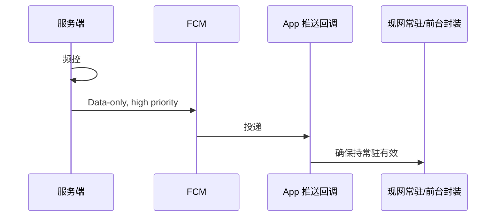

# FlareFlow · Android FCM 高优先级透传唤醒与常驻通知 — PRD

## 1. 是什么 & 为什么（唯一链路说明）

**要做的事（一条链）**：服务端对 Android 发 **FCM 纯数据透传**（用户**看不到**新推送条）→ 手机**尽量**把 App 叫醒 → App **只**调用**现网已有**的常驻通知 / 前台服务封装，**保证通知栏里那条 FlareFlow 常驻通知仍按现网规则显示或恢复**；**不**再弹营销通知、**不**加 App 内弹窗。

**白话（QA 主验收）**：发完透传后，**下拉通知栏**——仍是**线网那一条**常驻 FlareFlow，**没有**多一条广告推送，**没有** App 突然弹窗。

**背景**：常驻通知（短剧）**已实现且长期展示**；进程在后台可能被系统收紧，前台能力不稳。透传用于**提高被拉起概率**，**不**替代本地推送。

**范围**：**仅 Android**；不改常驻文案/渠道/法务叙事权威（仍现网 + 法务）；不锁 HTTP/SDK 类名（研发技术 spec 收口）。

---

## 2. 拍板与约束（验收口径汇总）

| 项 | 结论 |
|----|------|
| 平台 | 仅 Android |
| 消息形态 | **Data-only**；**无** FCM `notification` 段 → 系统**不**自动插一条新推送 |
| 优先级 | **一律 high priority** |
| 客户端 | 收到透传 → **轻量**走现网统一封装，**维持/恢复**常驻通知；**禁止**第二套常驻 / 重复 `startForeground` 分叉 |
| 服务端频控（默认，可远程改） | 相邻间隔 **≥30 min**；每设备 **≤48 条/自然日**；同一自然分钟 **合并为 ≤1 条**；可选：进程已活跃则拉长间隔（退避） |
| 诚实边界 | **不承诺**必达、秒达；强制停止 / 部分 OEM 可能长期收不到 |
| 非目标 | 不做 iOS；不新增营销推送 UI；不改变常驻业务含义定义权 |

---

## 3. 规则说明（客户端 + 服务端）

### 3.1 客户端

- **入口**：系统推送回调（如 `FirebaseMessagingService.onMessageReceived`），仅处理**纯 data** 唤醒类消息；与营销类推送分支区分（若共存）。
- **行为**：解析 payload → 调**现网唯一**「确保持常驻 / 前台」封装 → 主路径**短**（避免 ANR）；重活可排队，**不**阻塞回调。
- **容错**：非法 JSON / 缺 `id` / `v≠1` → 丢弃 + 打点，**不崩溃**；未知扩展字段忽略；同 `id` **24h 内**只算一次有效唤醒（幂等）。
- **禁止**：因本消息新增 `notification`、额外 `notify()` 营销渠道、App 内 Modal/Toast（现网另有需求除外）。

### 3.2 服务端

- 仅向**有效 FCM Token** 发送；Token 失效则从调度表移除。
- 发送前做 **频控**（上表默认）；误配 **low priority** 须在发布前拦截。
- FCM 429 等：**退避重试**，禁止忙等死循环。

### 3.3 流程（与上文同义，仅保留一图）

---

## 4. 数据约定

### 4.1 Data payload（业务字段）

| key | 必填 | 说明 |
|-----|------|------|
| `v` | 是 | 协议版本，当前 **1** |
| `id` | 是 | UUID 幂等键；重复投递不重复副作用 |
| `ts` | 否 | 服务端时间戳，便于日志 |
| `reason` | 否 | 建议 `HEARTBEAT`；未知值忽略 |

`data` 平铺或嵌套由研发按 FCM 限制实现。

### 4.2 频控参数（远程可配）

| 参数 | 默认 |
|------|------|
| 最小间隔 | ≥30 分钟 |
| 日上限 | 48 |
| 分钟合并窗口 | 60 秒 |
| 活跃退避系数 | 1.5～2.0（可选实现） |

---

## 5. 验收清单（研发 + QA）

1. **形态**：仅 data + high priority；通知栏**无** FCM 自动新条。  
2. **用户可见**：透传后 **10 秒内**（与 QA 机型集确认）下拉通知栏，**常驻仍在或与线网一致**；无第二条营销通知、无 App 内新弹层。  
3. **幂等**：同一 `id` 24h 内发 2 次，昂贵副作用 ≤1 次；无 ANR。  
4. **服务端**：1 分钟内请求 3 次下发 → 实际下发 ≤1；24h 内单设备 ≤48；日志/监控可见 priority 为 high。  
5. **自检**：无 `notification` 段；频控三件套生效；畸形 body 不崩溃。

---

## 6. 合规 · 性能 · 隐私（摘要）

- **合规**：对外口径对齐「短剧后台服务 / 续播」等真实价值；不单推「纯保活」话术（法务最终为准）。  
- **性能**：推送回调主路径无 ANR（具体 P99 由研发目标，如 <2s）。  
- **安全/隐私**：payload 不含可执行指令、密钥与用户身份明文；日志不打全量 Token/PII。

---

## 7. 影响与上线

| 侧 | 内容 |
|----|------|
| Android | 推送回调里增加/收敛唤醒分支；调用现网常驻封装 |
| 后端 | 唤醒发送 + 频控 + Token 清理；可选发送日志 |
| 第三方 | Google FCM |
| 观测（建议） | 发送量、失败率、解析失败率、Token 剔除 |

**上线顺序**：客户端（可灰度）→ 服务端频控与校验 → 远程默认参数 → 小流量看到达与耗电 → 全量。

**发送意图（业务级）**：向单设备发唤醒 Data；字段含 `device_token`、`id`、`v`、`ts`、`reason`；幂等键 `id`；无用户可见错误文案（Token 坏只停发）。

---

## 8. 待确认（默认不阻塞）

| 问题 | 默认 |
|------|------|
| 访客/无登录是否进唤醒池 | 跟现网 Token 策略 |
| 夜间静默 | 默认关，可远程开 |
| 「已活跃」判定窗口 T | 默认约 15 min 内有前台则退避，可远程配 |

---

**文档结束**
