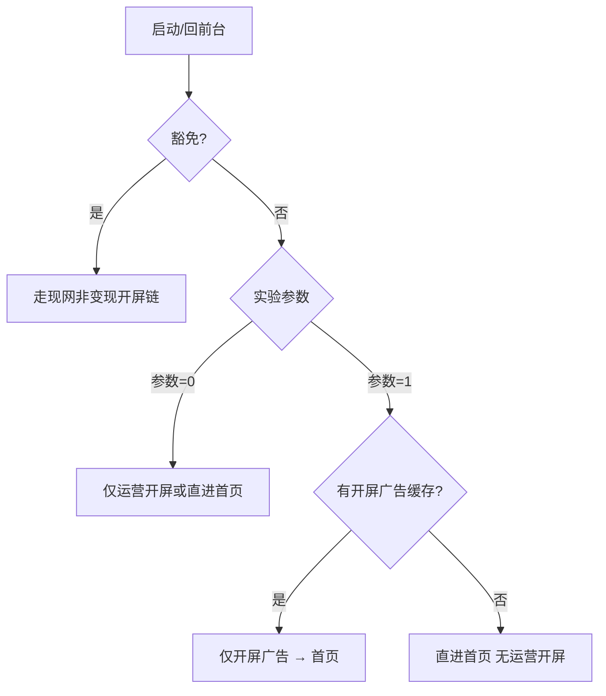
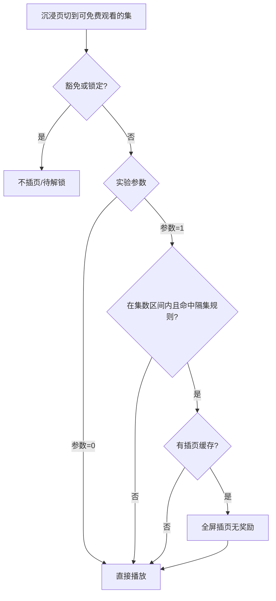

# FlareFlow · 开屏广告顺序与免费集插页 AB — PRD

## 1. 需求背景

FlareFlow 需在**不改动待解锁页广告解锁形态**（另见 `docs/20260513/PRD/待解锁页广告解锁改插页/`）的前提下，验证两类变现策略：**启动时展示运营开屏还是开屏广告**，以及**播放免费剧集时切集是否插入无奖励插页**。现网默认**优先展示运营配置的开屏营销页**；竞品（ReelShort 等）普遍在运营素材之后还会追加**开屏广告**，且对免费剧采用「隔几集弹全屏插页、没广告就不挡播放」策略。

本期要通过 **两个彼此独立** 的 AB 实验回答：① 用 **开屏广告** 替代运营开屏（单次启动二者**只能展示一个**），是否提升广告收入且留存可接受；② **播放免费剧集时**每隔 2 集插入无奖励插页，是否提升 ARPU 且完播/留存可接受。各实验参数、频控与豁免规则须写清，避免与访客合规、订阅权益、其它广告位冲突。

### 1.1 决策上下文（研发/QA 易犯偏差）

| 类型 | 内容 |
|------|------|
| 考虑过但放弃 | **合并为一个 AB key**：开屏与插页对用户心智与指标不同，须独立 key 与参数（`ios_open_ads-test` 与 `ios_free_interstitial-test` 分开）。 |
| 考虑过但放弃 | **实验组 A 先广告再运营**：单次启动**只能二选一**；A 组**只展示开屏广告、不展示运营开屏**。 |
| 考虑过但放弃 | **无缓存时等待加载开屏/插页**：竞品与现网一致——没广告可播则**跳过**，不黑屏阻塞。 |
| 考虑过但放弃 | **插页看完发币/解锁**：本期为**普通全屏插页广告**，无奖励；与待解锁页「看广告解锁」不是同一路径。 |
| FAQ | 待解锁页会插页吗？——**本需求不改**待解锁页；仅改启动开屏顺序 + 沉浸播放页免费集切集插页。 |
| 五类角色偏差 | **前端**：勿把两个实验绑在同一远程开关。**广告/SDK**：开屏广告与播放页插页用不同广告位。**数据**：分实验报表，勿混参数/实验。 |

---

## 2. 需求概述

| 维度 | 规则 |
|------|------|
| 实验数量 | **2 个独立 AB**，参数互不影响；完整逻辑分别在 **5.1 开屏实验**、**5.2 插页实验** |
| 开屏实验（S-01） | 见 **5.1** |
| 插页实验（I-01） | 见 **5.2** |
| 默认 | **实验参数**（0/1 分组）默认值 = **0**；**子开关**默认值见各实验 **5.1.4 / 5.2.4**（跟现网、竞品，**不是**一律 0） |
| 本期不做 | 待解锁页广告形态、退出播放页插页、列表原生广告、片内中插（IMA）、DRM、改订阅全局规则 |

> **白话（开屏）**：一次打开 App，**要么**看运营活动图、**要么**看一条变现全屏广告，**不会两个连着看**。对照组还是运营图；实验组 A 只看变现广告，**不会再弹运营活动图**。

> **白话（插页）**：对照组看免费剧时不会在切集时被全屏广告打断；实验组 A 会在第 2、4、6… 集前可能被全屏广告打断一次，**看完也不给币**，关掉接着播。

---

## 3. 目标用户与使用场景

### 3.0 两个实验的关系

- **S-01（开屏）** 与 **I-01（插页）** 各读各的 **参数**（0=对照组、1=实验组 A），互不影响。
- 同一用户可同时为「开屏参数=1 + 插页参数=0」等任意组合。

---

### 3.1 开屏实验（S-01）· 分群与场景

| 分群 | 判定摘要 | 行为 |
|------|----------|------|
| 参数 **0**（对照组） | `ios/android_open_ads-test` 下发 **0** | **仅**运营开屏（命中时），**不展示**开屏广告 |
| 参数 **1**（实验组 A） | 同上 key 下发 **1** | **仅**开屏广告，**禁止**运营开屏；频控见 **5.1.4** 子开关默认值 |
| **有效订阅 / VIP** | 现网判定有效订阅 | **不展示**开屏变现广告（与参数无关） |
| **访客（未同意隐私）** | 无 UID，未 init 广告 SDK | **不展示** |

**场景 1 — 参数 0 · 冷启动**  
用户杀进程后打开 App → **Logo 固定 2 秒** → 运营开屏（若命中）→ 首页。

**场景 2 — 参数 1 · 有开屏广告缓存**  
用户打开 App → **Logo 固定 2 秒** → **满 2 秒后**展示开屏广告全屏 → 关闭 → **直接进首页**（**不**展示运营开屏）。

**场景 3 — 参数 1 · 无开屏广告可播**  
用户打开 App → **Logo 固定 2 秒** → **2 秒内**仍拉不到广告则**再延长 5 秒**拉取；**共 7 秒内**仍无货 → **跳过**开屏广告、**直进首页**（**不**展示运营开屏）。

---

### 3.2 插页实验（I-01）· 分群与场景

| 分群 | 判定摘要 | 行为 |
|------|----------|------|
| 参数 **0**（对照组） | `ios/android_free_interstitial-test` 下发 **0** | **播放免费剧集时**切集**不弹**本需求插页 |
| 参数 **1**（实验组 A） | 同上 key 下发 **1** | **播放免费剧集时**按 **5.2.4** 子开关隔集插页（默认第 1–10 集、每隔 2 集） |
| **有效订阅 / VIP** | 现网判定有效订阅 | **不展示**插页 |
| **访客** | 未 init 广告 SDK | **不展示** |
| 待解锁·锁定集 | 当前集需付费解锁 | **不插页**，走待解锁门闸 |

**场景 4 — 参数 0 · 刷免费剧**  
沉浸播放页连续看免费集 → 切集**不弹**本需求插页。

**场景 5 — 参数 1 · 进入第 4 集且有缓存**  
进入第 4 集 → 全屏插页 → 关闭后继续第 4 集，**无奖励**。

**场景 6 — 参数 1 · 应插页但无缓存**  
**立即**播放正片，不额外等待。

---

## 4. 核心用户动线

### 4.1 开屏实验（S-01）



### 4.2 插页实验（I-01）



---

## 5. 功能详细描述

> 本章含 **2 个独立 AB**。请先读完 **5.1 开屏实验**，再读 **5.2 插页实验**。  
> 写作规范见 `.claude/skills/prd-writer-master/ab_ad_experiment_prd_template.md`。

### 单实验小节顺序（5.1 / 5.2 相同）

| 顺序 | 小节 | 内容 |
|------|------|------|
| 1 | 实验 Key | iOS / Android 对照 |
| 2 | 参数（0/1） | 分组行为；**参数默认 0** |
| 3 | 产品铁律 | 互斥等（若有） |
| 4 | 子开关 | **子开关的 key**、真实默认值 |
| 5 | 线框 | 线框在前 |
| 6 | 补充规则 | **仅**上文未写项 |
| 7 | 预加载与展示上限 | 预加载必执行；展示判定 |
| 8 | 状态 | 链路状态 |
| 9 | 验收标准 | Gherkin |

---

### 5.1 开屏实验（S-01）

**目标读者**：前端、广告/SDK、QA、配置后台。

#### 5.1.1 实验 Key

| 说明 | iOS key | Android key |
|------|---------|-------------|
| 运营开屏 vs 开屏广告（单次启动二选一） | `ios_open_ads-test` | `android_open_ads-test` |

Key 命名规范见 `.claude/skills/prd-writer-master/ab_experiment_key_standard.md`。

#### 5.1.2 参数（实验分组 · int）

> 本实验通过上述 key 下发的 **参数** 决定用户走对照还是实验组 A。**参数默认值 = 0**。

| 参数值 | 含义 | 本实验行为 |
|--------|------|------------|
| **0** | 对照组 | 单次启动：**仅**可走运营开屏（命中时），**不展示**开屏广告 |
| **1** | 实验组 A | 单次启动：**仅**可走**开屏广告**（有缓存且通过校验时），**禁止**运营开屏 |

> **白话**：参数 **0** = 还是运营活动图；参数 **1** = 一次打开 App 只看开屏广告、**不再**看运营活动图。

#### 5.1.3 单次启动互斥（产品铁律）

| 规则 | 说明 |
|------|------|
| 二选一 | 同一次启动（含冷启/热启触发的当次开屏链路），**运营开屏**与 **开屏广告** **最多展示 1 个** |
| 参数 **0** | 走现网运营开屏逻辑；**不**展示开屏广告 |
| 参数 **1** | 优先尝试开屏广告；**即使**运营开屏配置命中、素材已下载，**也不展示**运营开屏 |
| 参数 **1** 且无填充 | 按 **5.1.6** 拉货超时后 **直进首页**，**仍不**降级展示运营开屏 |

#### 5.1.4 子开关（实验 key 下 · int）

> 下列 **子开关** 挂在 **`ios_open_ads-test` / `android_open_ads-test`** 下，与 **5.1.2 参数（0/1 分组）** 不同。**仅当 5.1.2 参数 = 1** 时参与逻辑。  
> **默认值来源**：竞品 ReelShort `start_ad_switch`（`d:\反编译\AD_LOGIC_白话版.html` 第三章）、FlareFlow 现网 `app_open`（⚠️ 上线前与研发真值表核对）。

| 子开关的 key | 类型 | 默认值 | 需求逻辑（未改配置时） | 远程改配 |
|--------|------|--------|------------------------|----------|
| `hot_start_enable` | int | **0** | 仅**冷启动**尝试开屏广告；从后台回到前台**不**走本实验开屏 | 设为 **1**：回前台也允许尝试（仍须互斥、频控、有缓存） |
| `inter_time_sec` | int | **60** | 距上次开屏广告**成功关闭**至少 **60 秒**后才可再试 | 设为 **N**：至少 **N** 秒（竞品默认 **1 分钟**） |
| `max_per_session` | int | **10** | 当前 **Main 主页会话**内开屏广告成功展示 **≤ 10 次**（离开 Main 后计数清零） | 设为 **N**：会话内 **≤ N** 次（竞品默认 **10**） |

#### 5.1.5 线框 · 启动顺序

**参数 = 0（对照组）**

```
[ Logo 2 秒 ] → [ 运营开屏全屏（可选）] → [ 首页 ]
```

**参数 = 1（实验组 A）**

```
[ Logo 2 秒 ] → [ 开屏广告全屏（可选；无缓存时最多再等 5 秒拉货）] → [ 首页 ]
```

> **不展示运营开屏**。单次启动只会出现「运营开屏」或「开屏广告」之一。

#### 5.1.6 补充规则

> 分组、互斥、子开关、预加载与频控见 **5.1.2～5.1.4、5.1.7**；本节**只写上文未覆盖**项。

> **白话**：先播 **2 秒 Logo**。有广告缓存时，Logo 播完就弹开屏广告。没缓存时：先给 **2 秒**要广告，还拿不到就**再多等 5 秒**；**一共 7 秒**仍没有就进首页，绝不改弹运营开屏。

| 项 | 规则 |
|----|------|
| **Logo 与开屏广告时机（参数 = 1）** | 冷/热启进入开屏链路，且已满足 **5.1.2～5.1.4、5.1.3** 时：**① Logo** 固定展示 **2 秒**（Lottie/静态兜底，与现网 **FF 1.2.6** 一致）。**② 有未过期缓存**：Logo **满 2 秒**后展示开屏广告全屏（展示前仍须 SDK 校验通过）。**③ 无缓存**（无货、失效、SDK 无填充）：自启动链路起 **0～2 秒**内发起或继续 `app_open` 拉取；**2 秒内有填充** → **第 2 秒后**展示开屏广告；**2 秒内无填充** → 拉取**再延长 5 秒**，**5 秒内任意时刻有填充则立即展示**；**满 2+5 秒（共 7 秒）仍无填充** → **跳过**开屏广告、**直进首页**（**不**展示运营开屏、**不**为等待单独全屏 Loading） |
| 与其它全屏广告 | 激励、插页、待解锁页广告等**正在播**时，**不**再弹开屏广告 |
| 外部拉起 | 推送/深链进主页且会话标记为外部拉起时，**不**弹开屏广告 |
| 无填充上报 | 跳过开屏广告时，失败原因可上报（⚠️ 事件名研发深化） |
| 用户豁免 | 有效订阅 / VIP、访客等：**不**进入开屏广告逻辑（见 **3.1**） |

#### 5.1.7 预加载与展示上限（开屏广告）

> **预加载**：`app_open` **始终按现网执行预加载**（本需求**不提供**关闭或调节预加载的子开关）。**参数 = 1** 时在满足条件时**消费**缓存尝试展示；**参数 = 0** 不展示开屏广告，预加载与缓存策略仍跟现网。  
> **白话**：广告总要先下好；该弹时有货就弹，没货别卡用户；别在短时间内连弹很多次。

**广告位**：`app_open`（开屏广告）；兜底顺序 ⚠️ 与现网配置一致（常见为插页 / 全屏原生，本 PRD 不展开）。

##### 预加载：何时拉取、何时作废

| 时机 / 条件 | 客户端行为 |
|-------------|------------|
| **App 冷启动**（进程起来后） | 后台发起 `app_open` 预加载；**不**为预加载单独挡 Logo / 首页 |
| **开屏广告展示并关闭**（缓存被消耗） | 立即触发**下一次**预加载（为后续冷启 / 热启或同会话内下一次尝试备库） |
| **预加载请求失败** | **60 秒**后可重试；Android 保活场景与现网一致（历史需求：保活仅预加载开屏格式，失败间隔 60s） |
| **缓存仍有效** | 展示前可直接用缓存拉起全屏；有效期跟**现网 / SDK 默认**（历史索引建议 **4 小时**，⚠️ 研发对齐） |
| **缓存超过有效期** | 视为无缓存：客户端**自动重新预加载**；展示前拉货与等待按 **5.1.6**（2 秒 + 可延长 5 秒） |
| **参数 = 0** | **不展示**本实验开屏广告；`app_open` 预加载**仍执行**（与现网一致，不在此实验消费） |

##### 展示：何时尝试、何时跳过

> 参数 **1**、冷/热启动、间隔与会话次数见 **5.1.2、5.1.4**；互斥与豁免见 **5.1.3、5.1.6**。

| 条件 | 是否尝试展示 |
|------|----------------|
| 有未过期预加载缓存且 SDK 校验通过 | **是** |
| 无缓存 / 已过期 / SDK 无填充 | 按 **5.1.6**：**2 秒**内无货可**再延长 5 秒**拉取；**满 7 秒**仍无货 → **否**，直进首页；**不**降级运营开屏 |
| 未满足上文参数/子开关/互斥/豁免 | **否** |

##### 展示上限（频控）

> 间隔秒数、Main 会话次数见 **5.1.4** 子开关（默认 60s、10 次）。本节只补**铁律**：

| 维度 | 规则 |
|------|------|
| **单次启动链路** | 同一次冷/热启开屏链路内成功展示 **≤ 1 次**（与 **5.1.3** 二选一一致；子开关**不可**放宽为连弹两次） |
| **自然日** | ⚠️ 若现网 `app_open` 有日上限则保持一致；无则本期不新增 |

##### 展示后

| 事件 | 行为 |
|------|------|
| 用户关闭开屏广告（成功） | 计一次「成功展示」；消耗当前缓存；触发**预加载下一发**；**直接进首页**（不接运营开屏） |
| 展示失败 / 无填充 | 不计入成功展示次数；上报失败原因；不阻塞进首页 |

#### 5.1.8 状态

| 状态 | 表现 |
|------|------|
| 加载中 | **Logo 固定播满 2 秒**；期间可后台拉 `app_open`；**不**为拉广告单独全屏 Loading |
| 成功展示并关闭 | **直接进首页**（不接运营开屏，见 **5.1.3**） |
| 无填充/失败 | **直进首页**，不降级运营开屏；无缓存时自启动起最多 **2+5 秒**（见 **5.1.6**） |

#### 5.1.9 验收标准

```gherkin
Feature: 开屏实验 S-01

Scenario: 参数0不播开屏广告
  Given 用户 ios_open_ads-test 或 android_open_ads-test 参数为 0
  And 用户非 VIP 且非访客
  When 用户冷启动进入 App
  Then 不应出现开屏广告全屏
  And 若运营开屏命中则可展示运营开屏

Scenario: 参数1有缓存仅开屏广告且无运营开屏
  Given 用户开屏实验参数为 1
  And 开屏广告已预加载成功
  And 运营开屏配置命中
  When 用户冷启动
  Then Logo 应展示满 2 秒
  And 满 2 秒后应展示开屏广告全屏
  And 用户关闭广告后应直接进入首页
  And 不应展示运营开屏

Scenario: 参数1无缓存直进首页且无运营开屏
  Given 用户开屏实验参数为 1
  And 开屏广告无缓存
  And 运营开屏配置命中
  And 启动后 7 秒内始终无开屏广告填充
  When 用户冷启动
  Then Logo 应展示满 2 秒
  And 应在 7 秒内进入首页
  And 不应展示开屏广告全屏
  And 不应展示运营开屏
  And 不应出现持续黑屏等待

Scenario: 参数1展示后预加载下一发
  Given 用户开屏实验参数为 1
  And 开屏广告已展示并成功关闭
  When 客户端进入下一次可尝试开屏的时机
  Then 应已触发 app_open 预加载请求
  And 不应为预加载单独展示全屏 Loading

Scenario: 会话内达到展示上限不再弹
  Given 用户开屏实验参数为 1
  And max_per_session 子开关为 2
  And 当前主页会话内已成功展示开屏广告 2 次
  When 用户再次满足冷启动开屏条件
  Then 不应再展示开屏广告
```

---

### 5.2 插页实验（I-01）

**目标读者**：前端、广告/SDK、QA、配置后台。

#### 5.2.1 实验 Key

| 说明 | iOS key | Android key |
|------|---------|-------------|
| 播放免费剧集时切集插页 | `ios_free_interstitial-test` | `android_free_interstitial-test` |

#### 5.2.2 参数（实验分组 · int）

> 本实验通过上述 key 下发的 **参数** 决定对照 / 实验组 A。**参数默认值 = 0**。

| 参数值 | 含义 | 本实验行为 |
|--------|------|------------|
| **0** | 对照组 | **播放免费剧集时**切集**不弹**本需求插页 |
| **1** | 实验组 A | **播放免费剧集时**，每隔 **X** 集弹一个插页广告；**X** 由子开关 `interval_episodes` 决定（**默认 X=2**，即在默认第 1–10 集内于第 **2、4、6、8、10** 集尝试插页） |

> **白话**：参数 **0** = 看免费剧切集不打断；参数 **1** = 第 2、4、6… 集可能被全屏广告打断，**不给币**。

#### 5.2.3 线框 · 切集插页

**参数 = 1 · 进入第 N 集（默认 N ∈ {2,4,6,8,10}）**

```
┌─────────────────────────────────────────┐
│  沉浸播放页 · 第 N 集加载成功            │
│         ↓（满足插页条件且有缓存）        │
│  ┌───────────────────────────────────┐  │
│  │  全屏插页广告（无奖励）            │  │
│  │  [关闭]                           │  │
│  └───────────────────────────────────┘  │
│         ↓ 关闭后                         │
│  继续播放第 N 集正片                     │
└─────────────────────────────────────────┘
```

**参数 = 0**：上图中插页整段**不出现**。

#### 5.2.4 子开关（实验 key 下 · int）

> 下列 **子开关** 挂在 **`ios_free_interstitial-test` / `android_free_interstitial-test`** 下。**仅当 5.2.2 参数 = 1** 时参与判定。  
> **默认值来源**：本期实验设计（前 10 集、隔 2 集）+ 竞品 ReelShort 免费剧隔集插屏（`d:\反编译\AD_LOGIC_白话版.html` 第五章）；`inter_time_sec` / `max_per_play_session` 默认 **0** 表示不额外加秒级/会话 cap（⚠️ 与现网核对）。

| 子开关的 key | 类型 | 默认值 | 需求逻辑（未改配置时） | 远程改配 |
|--------|------|--------|------------------------|----------|
| `start_episode` | int | **1** | 从第 **1** 集起参与隔集插页判定 | 设为 **N**：从第 **N** 集起 |
| `end_episode` | int | **10** | 仅第 **1～10** 集可触发 | 设为 **N**：仅第 1～**N** 集 |
| `interval_episodes` | int | **2** | 每隔 **2** 集弹 1 次（第 2、4、6、8、10 集） | 设为 **N**：每隔 **N** 集弹 1 次（例：3 → 第 3、6、9 集） |
| `inter_time_sec` | int | **0** | **不**额外按秒限间隔（仅受隔集 + 集数区间约束） | 设为 **N**：距上次成功关闭至少 **N** 秒 |
| `max_per_play_session` | int | **0** | **不**另设播放会话总次数上限（仅受区间 + 隔集约束；默认范围内最多约 **5** 次触发点） | 设为 **N**：单次进入播放页会话内成功展示 **≤ N** 次 |

#### 5.2.5 补充规则

> 参数、子开关、预加载、展示判定与频控见 **5.2.2、5.2.4、5.2.6**；本节**只写上文未覆盖**项。

| 项 | 规则 |
|----|------|
| **触发时机** | 在**新一集加载成功 / 切集完成**时进入是否弹插页的判定（弹不弹见 **5.2.6**） |
| **奖励** | **无**；关闭后继续当前集正片 |
| **画中画** | **跳过**，不弹 |
| **与其它全屏广告** | 其它全屏广告正在播时，**不叠**第二个 |
| **数据场景** | 建议对齐现网 **`immersion_free_int`**（⚠️ 与数据确认编号） |

#### 5.2.6 预加载与展示上限（插页广告）

> **预加载**：`immersion_free_int` **始终按现网执行预加载**（本需求**不提供**关闭或调节预加载的子开关）。**参数 = 1** 且命中触发条件时**消费**缓存尝试展示；**参数 = 0** 不展示本需求插页，预加载仍跟现网。  
> **白话**：进播放页就会攒广告；该弹的那一集有货就弹，没货立刻播剧；同一集最多弹一次。

**广告位**：`immersion_free_int`（免费剧集插页）；双单元 fallback ⚠️ 与现网一致。

##### 预加载：何时拉取、何时作废

| 时机 / 条件 | 客户端行为 |
|-------------|------------|
| **进入沉浸播放页**（打开某剧播放页） | **必须**预加载 1 发插页（与现网一致） |
| **插页展示并关闭**（缓存消耗） | **必须**立即预加载下一发 |
| **用户切到「下一个可能触发插页」的集之前** | 若当前无有效缓存，**后台**续拉（⚠️ 与现网对齐，**不**挡正片起播） |
| **上一个广告消耗完**（现网通用事件） | 触发预加载（与历史「缓存时机」一致） |
| **预加载失败** | **不挡播放**；按现网策略间隔重试（⚠️ 秒数与现网对齐，见 **8.2 待确认**） |
| **缓存超时** | 跟**现网 / SDK 默认**（历史索引：**60 分钟**未用失效等；与 SDK 硬过期并存时取**更严**）；超时后客户端**自动重新预加载** |
| **参数 = 0** | **不展示**本需求插页；`immersion_free_int` 预加载**仍执行**（与现网一致） |

##### 展示：何时尝试、何时跳过

> 参数 **1**、免费/锁定、集数区间与隔集见 **5.2.2、5.2.4**；秒级间隔与会话总 cap 见 **5.2.4**（`inter_time_sec`、`max_per_play_session`）；画中画 / 叠播见 **5.2.5**。

| 条件 | 是否尝试展示 |
|------|----------------|
| 参数 **1** 且满足 **5.2.4** 集数与隔集，且有有效缓存、SDK 有填充 | **是** |
| 无缓存 / 过期 / 无填充 | **否** → **500ms 内**起播，不全屏等待 |
| 该集本次停留已展示过本需求插页 | **否**（**同一集 ≤1 次**，见下表） |
| VIP / 访客 / 锁定集 / 未命中 **5.2.4** | **否** |

##### 展示上限（频控）

> 隔集步长、集数区间、秒级间隔、会话总 cap 的**数值**见 **5.2.4**。本节只补**未在子开关表写明的铁律**：

| 维度 | 规则 |
|------|------|
| **单集** | 同一 `episode_index` 本次停留中，成功展示 **≤ 1 次** |
| **自然日** | ⚠️ 若现网对 `immersion_free_int` 有日上限则保持一致；无则本期不新增 |

##### 展示后

| 事件 | 行为 |
|------|------|
| 用户关闭插页（成功） | 计一次成功展示；消耗缓存；预加载下一发；**继续播放当前集正片**，无奖励 |
| 无缓存 / 失败 | 不计成功次数；立即播正片；后台可继续预加载 |

#### 5.2.7 状态

| 状态 | 表现 |
|------|------|
| 不应触发 | 见 **5.2.6**「展示：何时尝试」**否**分支 → 直接播放 |
| 应触发无缓存 | 直接播放；后台可继续预加载 |
| 展示成功 | 全屏插页 → 关闭后继续当前集 |
| 展示失败 | 同无缓存 |

#### 5.2.8 验收标准

```gherkin
Feature: 插页实验 I-01

Scenario: 参数0播放免费剧集时不插页
  Given 用户 ios_free_interstitial-test 或 android_free_interstitial-test 参数为 0
  And 用户在沉浸播放页观看免费剧
  When 用户连续进入第 2、4、6 集
  Then 不应出现本需求定义的全屏插页

Scenario: 参数1在第4集有缓存时插页
  Given 用户插页实验参数为 1
  And 插页已预加载
  When 用户进入第 4 集且该集为免费非锁定
  Then 应展示全屏插页
  And 关闭后应继续播放第 4 集正片
  And 不应发放金币或解锁权益

Scenario: 参数1第3集不插页
  Given 用户插页实验参数为 1
  When 用户进入第 3 集
  Then 不应因本需求弹插页

Scenario: 无缓存不挡播放
  Given 用户插页实验参数为 1
  And 进入第 2 集时应插页但无缓存
  When 集加载成功
  Then 应在 500ms 内开始正片播放
  And 不应出现全屏 Loading 等待广告

Scenario: 进入播放页必须预加载插页
  Given 用户插页实验参数为 1
  When 用户进入某剧沉浸播放页
  Then 应触发 immersion_free_int 预加载
  And 不应阻塞首集正片起播

Scenario: 同一集不重复插页
  Given 用户插页实验参数为 1
  And 用户已在第 4 集成功关闭本需求插页一次
  When 用户离开第 4 集后再次进入第 4 集
  Then 不应因本需求再次弹插页
```

---

### 5.3 与相关 PRD / 广告位关系

| 文档/资产 | 关系 |
|-----------|------|
| `docs/20260513/PRD/待解锁页广告解锁改插页/` | **独立**；不改待解锁「看广告解锁」 |
| `docs/20260513/PRD/访客模式与游客身份/` | 访客豁免；不 init 广告 |
| 历史索引 `app_open` | S-01 埋点/广告位对齐 |
| 历史索引 `immersion_free_int` | I-01 埋点/广告位对齐 |
| 竞品 `AD_LOGIC_白话版` | 参考隔集、无缓存；竞品开屏为「先运营后开屏广告」，本期 A 组为**仅开屏广告、不要运营开屏** |

---

## 6. 埋点与实验指标

### 6.1 开屏实验（S-01）指标

| 类型 | 指标 |
|------|------|
| 核心 | 开屏广告展示率、eCPM、启动至首页耗时 |
| 护栏 | 次日留存、启动流失 |
| 分析维度 | **开屏实验参数**（0/1）× 平台 × 国家 × 新老用户 |

### 6.2 插页实验（I-01）指标

| 类型 | 指标 |
|------|------|
| 核心 | 插页展示率、广告 ARPU |
| 护栏 | 免费集完播率、次留、投诉 |
| 分析维度 | **插页实验参数**（0/1）× 平台 × 国家 × 新老用户 |

### 6.3 开屏实验（S-01）埋点

| 事件意图 | 触发时机 | 建议字段 |
|----------|----------|----------|
| 开屏广告尝试 | 调用展示开屏广告前 | `open_ads_param`（0/1）、`fail_reason`、`session_type`（cold/hot） |
| 开屏广告展示/关闭 | SDK 回调 | `duration_ms`、`ad_network` |

### 6.4 插页实验（I-01）埋点

| 事件意图 | 触发时机 | 建议字段 |
|----------|----------|----------|
| 免费集插页尝试 | 切集判定为应插页时 | `free_int_param`（0/1）、`drama_id`、`episode_index` |
| 免费集插页展示/关闭 | SDK 回调 | `duration_ms`、是否继续播放 |

---

## 7. 影响范围

| 模块 | 影响 |
|------|------|
| 启动页 / Main | S-01 顺序与频控 |
| 沉浸播放页 | I-01 切集判定与插页 |
| 广告 SDK | 开屏广告 + 播放页插页广告的预加载与互斥 |
| 远程配置 / 实验平台 | 双 key，各 key 独立 **参数（0/1）** + **子开关（int）**；**回滚**：将参数改回 **0** 或关闭实验 key 即恢复对照行为 |
| 数据报表 | 分实验看板 |

**不改**：待解锁页、退出播放页插页、任务中心激励、订阅计费逻辑。

---

## 8. 待确认问题

### 8.1 开屏实验（S-01）

| # | 项 | 状态 |
|---|-----|------|
| 1 | 热启动是否默认展示开屏广告 | 子开关默认 **0**（仅冷启动）；远程设为 **1** 开启 |

### 8.2 插页实验（I-01）

| # | 项 | 状态 |
|---|-----|------|
| 1 | `immersion_free_int` 场景编号是否与数据现网一致 | ⚠️ 上线前与数据对齐 |
| 2 | 参与插页的集数范围默认 1–10 集是否需按剧类型区分 | 默认全局；可按剧远程覆盖 ⚠️ |
| 3 | 插页预加载失败重试间隔、缓存失效与现网真值（无预加载子开关） | ⚠️ 研发对齐后关闭 |

### 8.3 开屏实验（S-01）· 现网频控真值

| # | 项 | 状态 |
|---|-----|------|
| 1 | `app_open` 默认间隔秒数、Main 会话 10 次上限是否与线上一致 | ⚠️ 研发对齐后关闭 |

---

## 9. 版本规划

| 阶段 | 内容 |
|------|------|
| **本期** | S-01 + I-01 双实验上线；实验参数默认 **0**；子开关默认值见 **5.1.4 / 5.2.4** |
| **Phase 2** | 按数据调 `end_episode`、间隔；退出播放页插页另立项 |
