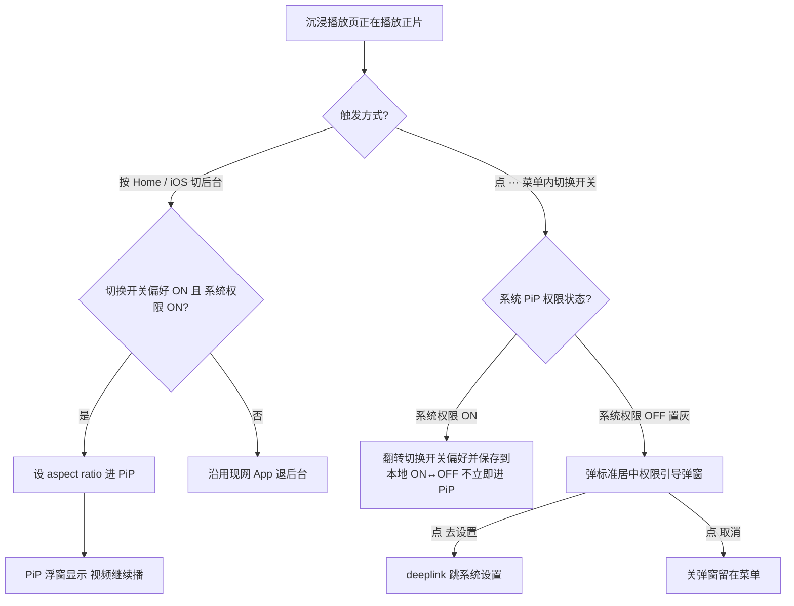
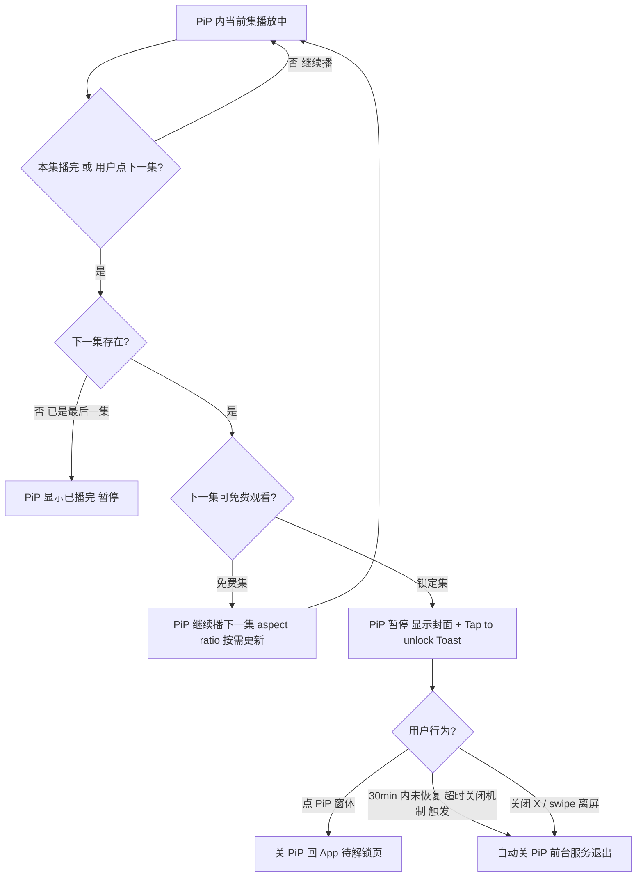

# FlareFlow · 画中画（Picture-in-Picture）

## 1. 需求背景

FlareFlow Android 端使用「媒体播放类型」前台服务（系统术语 `mediaPlayback`）（关联 [0514 Android-FCM 高优先级透传与常驻通知](../../../20260514/PRD/Android-FCM高优先级透传唤醒与常驻通知/)）维持 FCM 即时推送链路保活、常驻通知等链路。Android 12+ 起对前台服务的合规判定收紧——「媒体播放类型」前台服务须有"用户可见 media 真在播"的证据，否则会被系统回收，进而拖垮 FCM / 保活链路。**画中画（PiP）是合规的核心证据之一**：用户切走 App 时 PiP 浮窗仍可见、视频仍在播，前台服务 维持成立。

iOS 没有等价的前台服务概念，但 PiP 同样能延长用户观看时长——用户切换 App、聊天、复制粘贴时不必关掉 FlareFlow。

因此本期把 PiP 正式做成一个独立功能，统一规则：

- **合规边界（Android 主因）**：PiP 是前台服务续命的核心证据；无 PiP 链路则 FCM 即时推送/保活/常驻通知受影响。
- **体验边界（两平台共同）**：用户在多任务切换时仍能继续看剧；锁定集场景下 PiP 不打扰但给出明确的解锁回流入口。

---

## 2. 需求概述

| 维度 | 规则 |
|------|------|
| 平台 | iOS + Android；**Android 优先（合规）** |
| **系统最低支持** | **Android 8.0 (API 26)** / **iOS 14.0**——低于此版本设备 PiP 不可用，按现网退后台（前台服务 在低版本设备降级）|
| 适用身份 | 访客 / 游客 / 已登录 **三档全部可用**（限可免费观看的集；锁定集策略见 §5.4） |
| 触发方式 | **A. 系统手势**（Android 按 Home 自动；iOS App 主动 enter） + **B. 沉浸播放页右上角 `···` 菜单内手动入口** |
| 切集 | **自动连播下一集** + PiP 窗系统位上/下一集按钮 |
| 锁定集 | PiP **暂停在锁定集封面 + "Tap to unlock" Toast**；用户点 PiP 回 App 待解锁页 |
| 横屏剧支持 | **是**——进入 PiP 时根据当前集设置 aspect ratio；连播切横/竖时同步更新 |
| VIP 差异 | **无差异**（VIP 自然受益于"无锁定集"） |
| PiP 期间广告 | **全部豁免**（切集插页 / 开屏 / 激励均不触发） |
| 超时关闭机制 | PiP **实际未播放视频满 30 分钟**（停留在锁定封面）自动关闭 PiP，前台服务 干净退出 |
| 本期不做 | 跨剧 PiP 连播 / PiP 内点赞收藏倍速清晰度 / 弹幕 PiP |

> **白话（触发）**：用户在沉浸播放页**按 Home 键**（Android）或**点右上角 `···` → 画中画**（手动 iOS / Android），剧集变成一个浮窗继续播放，能切上下集。

> **白话（锁定集）**：连播或点下一集时如果是付费/未解锁集，PiP 不消失也不退出，而是停在那一集的封面上，叠"Tap to unlock"提示；用户主动点 PiP 才回 App 进待解锁页。30 分钟还没动 PiP 就自动收掉，让前台服务干净退出。

> **白话（身份）**：访客也能用 PiP，只是只能放免费集。VIP 不会遇锁定集，连播到底无障碍。

---

## 3. 目标用户与分群

| 分群 | PiP 可用 | 锁定集触发后回 App 行为 |
|------|---------|----------------------|
| VISITOR（访客） | ✓ | 用户点 PiP 回 App → **先弹隐私弹窗**（访客点付费控件须走隐私同意流程，与 [访客 PRD §7 播放页相关逻辑](../../../20260513/PRD/访客模式与游客身份/) 一致）；同意后才进待解锁页 |
| GUEST（游客） | ✓ | 用户点 PiP 回 App → 直接进待解锁页 |
| LOGGED_IN（已登录非 VIP） | ✓ | 同 GUEST；待解锁页按现网权益 |
| LOGGED_IN（VIP / 订阅有效） | ✓ | 全集可播；**不会遇到锁定集**，因此画中画不会暂停在封面、也不会被超时关闭机制自动关掉；连播到底 |

> **白话**：所有身份都能用 PiP；区别只在锁定集如何回流。

---

## 4. 核心用户动线

### 4.1 进入 PiP



### 4.2 PiP 内切集与锁定集



---

## 5. 功能详细描述

### 5.1 触发与进入 PiP

#### 5.1.1 触发方式总览

| 项 | 规则 |
|----|------|
| **Android 自动触发** | 用户在沉浸播放页**正在播放正片**时按 Home 键 / 任务键 / 上滑手势 → 若**用户的切换开关偏好 = ON** + 系统 PiP 权限 ON → 自动调用 `enterPictureInPictureMode()`；按当前集 orientation 配置 `setPictureInPictureParams`。**正片正在播是前提**；暂停态时按 Home 视为正常退后台（不进 PiP，沿用现网） |
| **iOS 自动触发** | App 从前台被切到后台时，若沉浸播放器正在播放正片 + 用户切换开关偏好 = ON + 系统 PiP 权限 ON → 调用 `AVPictureInPictureController.startPictureInPicture()` |
| **菜单切换开关** | 沉浸播放页**右上角 `···` 菜单**内的**「画中画」切换开关项**（下方 §5.1.2 详细） |
| **正在播广告时按 Home** | 进入 PiP 链路被阻断：广告 SDK 正在播任何全屏广告（开屏 / 待解锁页激励 / 别处插页）时按 Home 沿用现网，不强制进 PiP |
| **正在弹合规弹窗时按 Home** | 隐私弹窗、隐私二级挽留弹窗显示中按 Home 沿用现网（与 [访客 PRD](../../../20260513/PRD/访客模式与游客身份/) 不冲突） |

#### 5.1.2 菜单切换开关（核心 UX · 用户可控）

沉浸播放页 `···` 菜单内的「画中画」项是 **iOS-style 切换开关 UI**（与系统 Settings 视觉风格一致）。

**用户可控**：即使系统 PiP 权限 ON，用户也可在 App 内独立把 FlareFlow 的 PiP 关掉。点击切换开关 = **切换状态并保存到本地**（**不立即触发进入 PiP**）。

**状态决定矩阵**：

| 系统 PiP 权限 | 用户保存的用户选择 | 切换开关显示 | 用户点击切换开关行为 |
|--------------|--------------|-----------|-----------|
| **ON** | 未设置（首次） | **ON**（默认） | 切换为 OFF 并保存到本地；FlareFlow PiP 关闭（按 Home 不进 PiP） |
| **ON** | **ON** | **ON** | 切换为 OFF 并保存到本地 |
| **ON** | **OFF**（用户曾主动关） | **OFF** | 切换为 ON 并保存到本地；FlareFlow PiP 恢复 |
| **OFF** | 任意 | **OFF + 置灰** | 弹标准居中权限引导弹窗（见 §5.1.3）；切换开关状态不变 |

**状态联动**：

- 系统权限 OFF → 切换开关**强制显示** OFF + 置灰（不论用户保存的用户选择）
- 用户从系统设置开启权限后回到 App → 切换开关恢复显示**用户保存的用户选择**（如未设置则 ON）
- 保存方式（本地存储）：客户端本地（iOS NSUserDefaults / Android SharedPreferences），**不**上服务端

**关于「立即进 PiP」的入口**：

- **自动触发**：按 Home 系统手势（Android）/ App 切到后台（iOS）—— 需切换开关偏好 ON + 系统权限 ON
- **手动一键立即进 PiP**：**本期不提供**——切换开关点击仅切状态、不当作进入入口；这与 iOS 标准 PiP 模式一致（多数 iOS App 仅自动触发，无 App 内手动一键入口）

> **白话**：切换开关 = "你要不要让 FlareFlow 用画中画" 的偏好开关。**两个 ON 都满足**（系统权限 + 这里）才会在你按 Home / 切走 App 时让剧变浮窗。系统权限关时它强制变灰，点会弹对话框引导你去系统设置开。

#### 5.1.3 权限引导弹窗（系统权限关 → 用户点切换开关时弹）

**视觉**：按 baseline v1.1 §6.8.1 **标准居中弹窗**实现。

| 元素 | 内容 |
|------|------|
| 标题 | 「画中画权限未开启」（文案 Key `pip_perm_dialog_title`） |
| 正文 | 「画中画功能需要在系统设置中开启相应权限。」（文案 Key `pip_perm_dialog_body`） |
| 按钮 1（次） | 「取消」（文案 Key `pip_perm_dialog_cancel`）—— baseline `.btn-privacy` 中性深色风格 |
| 按钮 2（主） | 「去设置」（文案 Key `pip_perm_dialog_confirm`）—— baseline CTA-A 橙色 |
| 点「取消」 | 关弹窗，留在 `···` 菜单 |
| 点「去设置」 | 跳系统设置 PiP 权限页（Android：尝试 deeplink，若 OS 不支持则跳 App 详情页；iOS：跳 Settings.app FlareFlow 项） |
| 关闭 X | 标准居中弹窗顶右白圆 X；点击同「取消」 |

#### 5.1.4 菜单文案多语言

| Key | 中文 | 建议英文 |
|-----|------|---------|
| `pip_menu_entry` | 画中画 | Picture-in-Picture |
| `pip_perm_dialog_title` | 画中画权限未开启 | Picture-in-Picture is off |
| `pip_perm_dialog_body` | 画中画功能需要在系统设置中开启相应权限。 | Enable Picture-in-Picture in System Settings to use this feature. |
| `pip_perm_dialog_cancel` | 取消 | Cancel |
| `pip_perm_dialog_confirm` | 去设置 | Open Settings |

⚠️ 其它语言由本地化补齐；最终译文以法务/本地化定稿为准。

### 5.2 PiP 窗内控件

PiP 窗内**仅使用 OS PiP API 提供的系统位**，不绘制自定义浮层 UI（OS PiP 多数版本仅允许 3 个系统控件位 + 默认关闭 X）。

| 位 | 控件 | 行为 |
|----|------|------|
| 1 | **上一集**（系统 `skip prev` icon） | 切换到上一集；规则同 §5.3 |
| 2 | **播放 / 暂停**（系统 `play/pause` icon） | 切换播放状态；暂停时前台服务仍可维持，**不触发** 超时关闭机制（超时关闭机制 仅针对锁定集封面态） |
| 3 | **下一集**（系统 `skip next` icon） | 切换到下一集；规则同 §5.3 |
| — | **关闭 X**（系统默认提供） | 关 PiP；按 §5.6 退出流程 |

> **白话**：PiP 浮窗里就 3 个按钮——上一集 / 暂停 / 下一集，加上右上角系统默认的关闭 X。其它任何控件（点赞、收藏、倍速、清晰度、**弹幕开关**等）都不放，用户回 App 全屏再操作。

**弹幕渲染策略**：PiP 期间**强制不渲染弹幕**——即使用户在全屏页打开了弹幕开关，PiP 窗内也**不显示**任何弹幕。理由：PiP 窗约 100×178 pt，弹幕字号小不易看清；强制关闭节省 CPU 与电量。用户**点 PiP 回 App 全屏**后，恢复用户原本的弹幕开关设置（PiP 期间不会修改用户的弹幕设置）。

**音频会话策略**：PiP 期间走 OS 标准音频会话（iOS `AVAudioSession.Category.playback` / Android 媒体音频流）；与其它 App 共存规则：

- **PiP 进入瞬间**：FlareFlow 视频的声音会**盖过其它 App 的声音**（与全屏播放一致），其它正在播放的音乐 App（Spotify / Apple Music 等）按系统标准被暂停或音量被压低
- **其它 App 主动抢音频**（用户在 PiP 期间打开音乐 App 等）：FlareFlow PiP **视频自动暂停 + 音频静音**；用户回到 FlareFlow 后**手动点 PiP 内播放按钮**才恢复播放，**不自动恢复**
- **来电 / 系统警告音**：参 §5.10 OS 自动收起 PiP 流程

### 5.3 切集与连播

| 项 | 规则 |
|----|------|
| **自动连播** | 当前集播完 → **自动切下一集**（Reels-style）；下一集请求按现网播放器走 |
| **手动切集** | PiP 窗系统位上一集 / 下一集按钮直接切；**首集**时上一集按钮**置灰**；**末集**时下一集按钮**置灰** |
| **横竖屏切换** | 切下一集后若 aspect ratio 与上一集不同（横↔竖），调用 OS API `setAspectRatio()` 实时更新 PiP 窗形状；用户感知为 PiP 窗轻微动画切换尺寸 |
| **弱网下一集请求失败** | 超时阈值 ⚠️ 与现网播放器对齐；3 次重试失败 → PiP 窗显示"已播完"暂停态（不自动退出 PiP；用户点 PiP 回 App 处理）|
| **播放归属（任务时长 / 观看进度 / 解锁次数 / 数据上报）** | **完全沿用现网**——PiP 期间播放与 App 内沉浸页播放等价（同一播放器，仅渲染容器不同）；看剧任务时长、播放进度同步、广告解锁次数等按现网逻辑累加 |

### 5.4 锁定集处理（关键路径）

**PiP 锁定集封面态 · ASCII 线框**

```
 ┌────────────────────────────┐
 │ ┌──────────────────────┐ │
 │ │ │ │
 │ │ [锁定集封面图] │ │ ← OS PiP 窗（系统渲染容器）
 │ │ │ │
 │ │ │ │
 │ │ Tap to unlock │ │ ← App 控制的 Toast 文字
 │ │ │ │
 │ │ ⊳⊳ ⏸ ⊲⊲ │ │ ← 系统位 3 控件
 │ │ 上一集 暂停 下一集 │ │ （锁定态下暂停 icon 已自动切换）
 │ └──────────────────────┘ │
 │ [×] │ ← 系统默认关闭 X
 └────────────────────────────┘
 OS PiP 浮窗（用户手机右下角）

 规则：
 • 视频已停止（不是暂停），不消耗 media 时间
 • Tap to unlock 文字叠在封面图上方，~中心位置
 • 用户点窗体任意非控件区 → 关 PiP + 回 App + 进待解锁页
 • 超时关闭机制 从「进入此态」开始计时；30 min 内未恢复播放 → 自动关 PiP
 • 横屏剧时：窗形 16:9，封面图与 Toast 同步适配
```

| 项 | 规则 |
|----|------|
| **触发条件** | PiP 内自动连播或用户点下一集，命中**当前身份下不可免费观看**的集（含付费集未解锁、VIP 已过期遇 VIP 集等） |
| **PiP 行为** | PiP 窗**不退出**；停止视频播放；窗内显示**该锁定集的封面图**（与现网待解锁页封面一致）+ Toast 文字 **"Tap to unlock"**（中文：「点击解锁」，文案 Key `pip_locked_unlock_hint`） |
| **用户点 PiP 窗体** | 关闭 PiP → App 切到前台 → 路由到该剧该锁定集的**待解锁页**（与现网 deeplink 一致） |
| **超时关闭机制（前台服务 风险缓解）** | PiP 状态 = "暂停在锁定集封面" 持续 **30 分钟**未恢复播放 → 客户端**自动关闭 PiP** →前台服务干净退出；用户下次回 App 沉浸播放页按现网"恢复进度"逻辑 |
| **超时关闭机制 reset 条件** | 用户在 PiP 内点击播放 / 切到下一集 / 点 PiP 回 App，timer 立即清零；用户切到下一集仍为锁定 → 新一轮 30 分钟计时 |
| **30 分钟阈值 vs 远程配置** | 本期**写死客户端常量**；如需远程配置另起 sub-task（见 §7 待确认 #4） |
| **访客触发锁定集** | 访客不能 IAP，几乎没有解锁路径；PiP 仍按上述显示封面 + "Tap to unlock"；用户点 PiP 回 App → **先弹隐私弹窗**（访客点付费控件须走隐私同意，沿用 [访客 PRD §7](../../../20260513/PRD/访客模式与游客身份/)）；同意后才进待解锁页 |

**身份动态变化处理**：PiP 期间用户身份可能动态变化（最典型场景：VIP 订阅期间过期）。客户端在**每次切集判定时实时查身份**，按当下身份重新判定该集是否锁定：

- **VIP 期间进 PiP → 期间 VIP 过期** → 切到下一 VIP 专属集时按本节锁定集策略（PiP 暂停在封面 + "Tap to unlock"）
- **普通用户期间通过其它路径升级 VIP**（如另设备完成订阅且服务端同步） → 切集时按 `LOGGED_IN` VIP 身份判定，原本可能锁定的集现可正常播
- **实时身份依据**：客户端缓存的最新身份状态（与现网播放页判定同源）；如服务端身份变化但本地未同步，按本地判定，下次刷新后再一致

### 5.5 广告交互（全部豁免）

| 广告类型 | PiP 期间行为 | 备注 |
|---------|-------------|------|
| **切集插页**（`immersion_free_int`） | **豁免，不弹** | 与 [0520 AB PRD §5.2.5](../../../20260520/PRD/开屏与免费集插页AB/) 一致；**无需改动 0520** |
| **开屏广告**（`app_open`） | **不可能触发** | PiP 期间 App 不在前台，开屏链路本来就不进入 |
| **激励广告**（解锁、签到、奖励翻倍等） | **不主动触发** | PiP 窗系统位不提供激励入口；用户必须主动操作 |
| **运营开屏 / 闪屏推荐** | **不可能触发** | 同开屏，不在 PiP 阶段 |
| **退出沉浸页挽留弹窗** | **不触发** | 用户进 PiP **不等同于退出沉浸页**（沉浸页仍在内存），现网挽留逻辑不触发 |

### 5.6 关闭与退出 PiP

| 触发 | 行为 |
|------|------|
| **用户点关闭 X**（系统提供） | 视频停止播放 → PiP 收起 → App 仍在后台（**不主动拉回前台**）→前台服务退出（无 media 可播）→ 下次回 App 沉浸页按现网"恢复进度"逻辑 |
| **用户点 PiP 窗体**（非控件区） | 关闭 PiP → App 切到前台并恢复**沉浸播放页全屏**；播放进度继续；若是锁定集封面态点击则进**待解锁页** |
| **用户 swipe PiP 离屏**（Android） | 等同于点关闭 X |
| **超时关闭机制 30 分钟触发**（仅锁定集封面态） | 等同于点关闭 X |
| **系统压力 / 系统强制关闭** | 视为正常退出；不弹任何提示；下次回 App 按现网恢复进度 |
| **推送 / Deep link 触发 App 切前台** | **立即关闭当前 PiP**（视频停止）→ App 切前台 → 按推送 deeplink 进**目标剧/集**（不是恢复原 PiP 沉浸页）；与"用户点 PiP 窗体"路径等价，但目标位置由 deeplink 决定 |

### 5.7 横屏剧支持

| 项 | 规则 |
|----|------|
| **识别方式** | 沿用 [FF-1.7.0 横屏需求](../../../../flareflow-app-snapshot/已上线功能/FF需求文档（App）/_EXTRACTED_INDEX.md) 现网每集元信息中的 orientation 字段 |
| **进入 PiP 时** | 客户端按**当前集实际 aspect ratio** 调用 OS API（Android `setAspectRatio()` / iOS layer bounds）；**具体比例完全交 OS 处理**，App 不指定固定值（如 9:16 / 16:9） |
| **连播切横↔竖时** | OS API `setPictureInPictureParams(AspectRatio = 新比例)` 实时更新；PiP 窗轻微动画切换尺寸 |
| **锁定集封面适配** | 锁定集封面图本身有横竖两版（现网已有）→ 按集 orientation 选对应封面 + "Tap to unlock" Toast 适配 |
| **用户手机自动旋转 vs PiP** | PiP 窗形状由**内容 orientation** 决定，**不受用户手机旋转影响**（PiP 是独立窗口，无方向感） |
| **超出 OS 比例限制**（如 21:9 等极端比） | 客户端 clamp 到 OS 支持范围（iOS 17+ 限制 0.418-2.39；Android 12+ 类似），具体 clamp 策略由研发自决 |

### 5.8 状态机

| 状态 | 表现 |
|------|------|
| **进入中** | OS 系统过渡动画（约 300ms）；App 不渲染自定义 loading |
| **正常播放** | PiP 窗视频播放中；3 个系统位控件可用 |
| **手动暂停** | 用户点暂停 → 视频暂停；前台服务 仍可维持；**不触发 超时关闭机制**（超时关闭机制 仅针对锁定封面态） |
| **锁定集封面态** | 显示封面 + "Tap to unlock"；超时关闭机制 timer 开始计时 |
| **切集中** | 短暂 spinner；新集加载完毕继续播放 |
| **弱网失败** | 见 §5.3 |
| **已播完末集** | 暂停态显示"已播完"；用户点 PiP 回 App |
| **退出中** | OS 系统过渡动画；前台服务 退出 |

### 5.9 验收标准

```gherkin
Feature: 画中画

Scenario: Android 按 Home 自动进入 PiP
 Given 用户在沉浸播放页正在播放免费集
 And 用户身份为 GUEST 或 LOGGED_IN
 And Android 系统画中画权限已开启
 When 用户按 Home 键
 Then 应进入 PiP 浮窗
 And 视频应继续播放
 And 前台服务应继续维持

Scenario: iOS 手动菜单触发 PiP
 Given 用户在沉浸播放页正在播放免费集
 And iOS 系统画中画权限已开启
 When 用户点击右上角 ··· 菜单 然后点击 画中画
 Then 应调用 AVPictureInPictureController.startPictureInPicture
 And 应进入 PiP 浮窗
 And 视频应继续播放

Scenario: PiP 内自动连播下一集
 Given 用户正在 PiP 内观看第 N 集
 And 第 N+1 集为免费集
 When 第 N 集播完
 Then 应自动开始播放第 N+1 集
 And 不应退出 PiP

Scenario: PiP 内手动点下一集
 Given 用户正在 PiP 内观看第 N 集
 And 第 N+1 集为免费集
 When 用户点击 PiP 窗内系统位下一集按钮
 Then 应立即切换到第 N+1 集播放

Scenario: PiP 末集时下一集按钮置灰
 Given 用户在 PiP 内观看本剧最后一集
 Then PiP 窗下一集按钮应置灰不可点击

Scenario: PiP 遇到锁定集暂停在封面
 Given 用户正在 PiP 内观看第 N 集
 And 第 N+1 集为锁定集
 When 第 N 集播完触发自动连播 或 用户点下一集
 Then PiP 窗应停止视频播放
 And 应显示第 N+1 集的封面图
 And 应叠加 "Tap to unlock" Toast
 And PiP 窗不应自动退出

Scenario: 锁定集场景下用户点 PiP 回 App
 Given 用户的 PiP 当前显示锁定集封面
 When 用户点击 PiP 窗体
 Then PiP 应关闭
 And App 应切到前台
 And 应路由到该剧该锁定集的待解锁页

Scenario: 超时关闭机制 30 分钟自动关闭 PiP
 Given 用户的 PiP 暂停在锁定集封面已达 30 分钟
 And 期间用户未点击 PiP 也未恢复播放
 When 30 分钟 超时关闭机制 触发
 Then PiP 应自动关闭
 And 前台服务应退出

Scenario: 超时关闭机制 在播放恢复时 reset
 Given 用户的 PiP 暂停在锁定集封面已达 10 分钟
 When 用户点 PiP 回 App 解锁该集 重回 PiP 继续播放
 Then 超时关闭机制 timer 应清零

Scenario: 用户点击 PiP 关闭 X
 Given 用户的 PiP 正在播放
 When 用户点击 PiP 右上角关闭 X
 Then 视频应停止播放
 And PiP 应收起
 And 前台服务应退出
 And App 不应主动切到前台

Scenario: VISITOR 访客可用 PiP 看免费集
 Given 用户为 VISITOR 访客
 And 用户在沉浸播放页正在播放免费集
 When 用户触发 PiP（自动或手动）
 Then 应进入 PiP 浮窗
 And 视频应继续播放

Scenario: VISITOR 在 PiP 中遇到锁定集
 Given 用户为 VISITOR 且在 PiP 内
 And 即将切到的集为锁定集
 When 自动连播或用户点下一集
 Then PiP 应停在锁定集封面 显示 Tap to unlock
 When 用户点击 PiP 窗体
 Then PiP 应关闭
 And App 应切到前台
 And 应先弹隐私弹窗
 And 不应直接进入待解锁页

Scenario: 切集插页在 PiP 期间豁免
 Given 用户的 PiP 正在播放免费集
 And 用户在 0520 AB 插页实验参数为 1
 And 本集按 0520 §5.2.4 看几集弹应弹插页
 When 集加载成功
 Then 不应触发 0520 PRD 定义的全屏插页
 And 视频应直接继续播放

Scenario: 横屏剧进入 PiP
 Given 用户在沉浸播放页观看一部横屏剧
 When 用户触发 PiP
 Then PiP 窗应以 16:9 aspect ratio 显示

Scenario: PiP 内横竖屏切换
 Given 用户的 PiP 正在播放横屏剧的当前集
 And 下一集的 orientation 为竖屏
 When 切到下一集
 Then PiP 窗 aspect ratio 应平滑切换为 9:16

Scenario: VIP 用户全集连播无 超时关闭机制
 Given 用户为有效订阅 VIP
 When 用户在 PiP 内连续观看 60 分钟
 Then PiP 应一直正常播放
 And 超时关闭机制 不应触发

Scenario: 系统未授予画中画权限按 Home 的降级
 Given Android 系统画中画权限被用户关闭
 When 用户按 Home 键
 Then 不应进入 PiP
 And 应沿用现网 App 进后台逻辑
 And 不应弹任何提示

Scenario: 系统权限关时菜单切换开关显示 OFF 置灰
 Given iOS 或 Android 系统画中画权限被关闭
 When 用户打开沉浸播放页右上角 ··· 菜单
 Then 画中画切换开关应显示 OFF
 And 应显示置灰视觉

Scenario: 系统权限关时点切换开关弹标准居中引导弹窗
 Given iOS 或 Android 系统画中画权限被关闭
 And 用户在 ··· 菜单看到切换开关显示 OFF 置灰
 When 用户点击切换开关
 Then 应弹标准居中权限引导弹窗
 And 弹窗标题应为 画中画权限未开启
 And 弹窗应含 取消 和 去设置 两个按钮
 And 切换开关状态不应变化

Scenario: 权限引导弹窗点去设置跳系统设置
 Given 权限引导弹窗已弹出
 When 用户点击 去设置
 Then 应尝试 deeplink 跳到系统设置 PiP 权限页
 And 若 OS 不支持 deeplink 应跳 App 详情页

Scenario: 权限引导弹窗点取消关闭弹窗
 Given 权限引导弹窗已弹出
 When 用户点击 取消 或 关闭 X
 Then 弹窗应关闭
 And 用户应留在 ··· 菜单
 And 不应进入 PiP

Scenario: 用户从系统设置开启权限后回 App 切换开关恢复用户偏好
 Given 用户菜单内切换开关之前显示 OFF 置灰
 And 用户保存的用户选择为 ON
 When 用户去系统设置开启 PiP 权限并返回 App
 Then 再次打开 ··· 菜单时切换开关应显示 ON 且不再置灰

Scenario: 切换开关 ON 时用户点击翻为 OFF 并保存到本地
 Given 系统 PiP 权限开 且 用户切换开关显示 ON
 When 用户点击 ··· 菜单内的画中画切换开关
 Then 切换开关应翻为 OFF
 And 用户选择应保存为 OFF
 And 不应立即进入 PiP

Scenario: 切换开关 OFF 时用户点击翻为 ON 并保存到本地
 Given 系统 PiP 权限开 且 用户切换开关显示 OFF 用户主动关过
 When 用户点击切换开关
 Then 切换开关应翻为 ON
 And 用户选择应保存为 ON
 And 不应立即进入 PiP

Scenario: 用户主动关切换开关后按 Home 不进 PiP
 Given 用户在沉浸播放页正在播放免费集
 And 系统 PiP 权限开 但 用户切换开关偏好为 OFF
 When 用户按 Home 键
 Then 不应进入 PiP
 And 应沿用现网 App 退后台逻辑

Scenario: 用户首次使用偏好为 ON 按 Home 自动进 PiP
 Given 用户从未触碰过切换开关 偏好为默认 ON
 And 系统 PiP 权限开 且 正在播放免费集
 When 用户按 Home 键
 Then 应进入 PiP 浮窗
 And 视频应继续播放

Scenario: 弱网下一集请求失败
 Given 用户的 PiP 正在播放
 And 网络状况较差
 When 自动连播触发下一集请求且 3 次重试均失败
 Then PiP 应保持当前集 已播完 暂停态
 And 不应自动退出 PiP

Scenario: PiP 期间 App 进程被系统强制退出
 Given 用户的 PiP 正在播放
 When 系统因内存压力强制终止 App 进程
 Then PiP 应正常关闭
 And 下次用户回 App 应按现网恢复进度逻辑

Scenario: 正在播全屏广告时按 Home 不进 PiP
 Given 用户的开屏 / 待解锁页 / 激励等全屏广告正在播
 When 用户按 Home 键
 Then 不应进入 PiP
 And 应沿用现网 App 进后台逻辑

Scenario: PiP 期间强制不显示弹幕
 Given 用户在沉浸播放页正在播放免费集
 And 用户全屏页弹幕开关为 ON
 When 用户进入 PiP
 Then PiP 窗内不应渲染任何弹幕
 When 用户点 PiP 回 App 全屏
 Then 全屏播放应恢复显示弹幕
 And 用户弹幕开关设置应保持为 ON 未被改写

Scenario: 用户双击 PiP 放大缩小不影响业务逻辑
 Given 用户的 PiP 正在播放
 When 用户双击 PiP 浮窗使其放大或缩小
 Then 视频应继续不中断播放
 And 连播 / 锁定集策略 / 超时关闭机制 等业务逻辑应不受影响

Scenario: 用户拖动 PiP 改变位置不影响播放
 Given 用户的 PiP 正在播放
 When 用户拖动 PiP 浮窗到屏幕另一位置
 Then 视频应继续播放
 And 切集与连播逻辑应不受影响

Scenario: PiP 期间 VIP 过期后下一集判定为锁定
 Given 用户为 VIP 在 PiP 内观看第 N 集
 And VIP 订阅在播放期间过期
 When 自动连播触发第 N+1 集判定
 And 第 N+1 集为 VIP 专属
 Then PiP 应暂停在第 N+1 集封面
 And 应显示 Tap to unlock Toast

Scenario: 推送 Deep link 触发立即关闭当前 PiP 跳目标
 Given 用户的 PiP 正在播放剧 A 第 N 集
 When 用户点击 FCM 推送 跳到剧 B 第 M 集 Deep link
 Then 当前 PiP 应立即关闭 视频停止
 And App 应切到前台
 And 应进入剧 B 第 M 集 不是恢复剧 A 沉浸页

Scenario: PiP 期间播放计入看剧任务时长
 Given 用户在 PiP 内观看免费集
 And 现网看剧任务条件为累计观看 30 分钟
 When 用户在 PiP 内观看 20 分钟 然后回 App 全屏观看 10 分钟
 Then 任务进度应累计为 30 分钟
 And 应满足任务完成条件

Scenario: 其它 App 抢音频时 PiP 自动暂停且不自动恢复
 Given 用户的 PiP 正在播放有声音的视频
 When 用户切到另一 App 打开音乐播放
 Then PiP 视频应自动暂停且音频静音
 When 用户回到 FlareFlow
 Then PiP 不应自动恢复播放
 And 用户需点 PiP 内播放按钮才恢复
```

---

### 5.10 OS 标准交互（App 不干预）

PiP 浮窗的**尺寸、位置、缩放、显隐**由 iOS / Android 系统自带的 PiP API 管控；App **不接管**任何 OS 原生手势。下表罗列**已知** OS 行为以便研发 / QA 对齐预期，**App 业务逻辑（连播、锁定集策略、超时关闭机制 等）不受这些尺寸/位置变化影响**。

| OS 手势 / 事件 | OS 行为 | App 是否干预 |
|---------------|---------|-------------|
| **双击 PiP 浮窗** | OS 切换 PiP 尺寸（放大 ↔ 缩小，档位由系统决定） | **否**——继续正常播放 |
| **拖动 PiP 浮窗** | OS 改变 PiP 位置（吸附屏幕角落或拖到的位置） | **否** |
| **单击 PiP 浮窗内的按钮位置**（上一集 / 暂停 / 下一集） | OS 显示 / 隐藏这三个按钮 | **否** |
| **单击 PiP 浮窗内的按钮位置以外**（画面区域） | App 处理：关 PiP + 切前台 + 路由（详见 §5.6） | **是** |
| **swipe PiP 离屏**（Android） | 关 PiP（详见 §5.6） | App 视为正常退出 |
| **OS 自动收起 PiP**（来电、低内存、系统强杀等） | 系统强制关 PiP | App 视同正常退出，下次回 App 按现网恢复进度 |

---

## 6. 影响范围

| 模块 | 影响 |
|------|------|
| 系统支持范围 | **Android 8.0 (API 26)+ / iOS 14.0+**；低于此版本设备 PiP 整链路降级到现网退后台 |
| 沉浸播放页 | 右上角 `···` 菜单加「画中画」**切换开关项**；切换开关用户选择保存在手机本地；进/退出 PiP 的状态管理；锁定集封面渲染；**PiP 期间弹幕渲染关闭 / 回全屏恢复** |
| 沉浸播放器（核心） | 接入 iOS `AVPictureInPictureController` + Android `PIP Mode API`；横竖屏 aspect ratio 动态切换；3 个系统位控件实现 |
| 前台服务 | 与 PiP 生命周期绑定；PiP 关闭时前台服务退出；**关闭瞬间是否需要短暂续命由研发深化**（PM 边界外） |
| iOS 配置 | **Info.plist 声明 PiP 相关 Background Modes** + **`AVAudioSession.Category.playback` 配置** 由研发深化（PM 边界外） |
| 待解锁页 | 从 PiP "Tap to unlock" 跳入待解锁页的 deeplink 处理（沿用现网） |
| **新增 UI 组件** | **权限引导弹窗**（按 baseline v1.1 §6.8.1 标准居中弹窗实现）—— 详见 §5.1.3 |
| 系统设置 deeplink | Android 跳 PiP 权限设置页 / iOS 跳 Settings.app FlareFlow 项 —— 研发对齐 |
| [0520 AB 插页实验](../../../20260520/PRD/开屏与免费集插页AB/) | §5.2.5 已豁免 PiP，**无新增改动** |
| [0514 Android-FCM + 常驻通知](../../../20260514/PRD/Android-FCM高优先级透传唤醒与常驻通知/) | PiP 是本 PRD 为前台服务提供的合规依赖；**0514 PRD 文字无需改** |
| [0513 访客 PRD](../../../20260513/PRD/访客模式与游客身份/) | **§6.2 弹层黑名单需补一句**「PiP 不在黑名单中（访客可在免费集范围内使用 PiP）」——**本 PRD 不一起改，留作后续 follow-up commit** |
| [0513 待解锁页广告解锁改插页](../../../20260513/PRD/待解锁页广告解锁改插页/) | 不改；PiP 仅复用其 deeplink 入口 |
| FF-1.7.0 横屏历史逻辑 | 不改；PiP 仅复用 orientation 字段识别 |
| 多语言 | 文案 Key `pip_menu_entry`（"画中画" / "Picture-in-Picture"）+ `pip_locked_unlock_hint`（"点击解锁" / "Tap to unlock"）+ `pip_permission_toast`（"请在系统设置中开启画中画权限" / "Please enable Picture-in-Picture in System Settings"）— 待法务/本地化定稿 |

**不改**：开屏广告策略、退出沉浸页挽留、订阅计费、任务中心、付费集解锁规则。

---

## 7. 待确认问题

> 大部分 PM 拍板项已在正文落定（见各节）。本节仅列**仍待研发对齐**的真实开放项：

| # | 项 | 状态 |
|---|----|------|
| 1 | Android 跳系统 PiP 权限设置页的 deeplink 可靠性（不同厂商 ROM 可能差异） | ⚠️ 研发对齐；fallback 至 App 详情页 |
| 2 | Android 目标用户 OS 分布与 8.0+ 覆盖率 | ⚠️ 数据团队复核 |
| 3 | 弱网下一集请求超时与重试阈值与现网播放器对齐（PM：**与现网一致，无新增**） | ⚠️ 研发实现时对齐现网常量 |

> 以下项 **PM 已拍板**，正文落定，仅记录决策出处：
> - **系统最低**：Android 8.0 / iOS 14.0（§2、§6）
> - **iOS entitlement / Audio Session 配置**：研发深化，PM 边界外（§6）
> - **超时关闭机制 30 分钟**：写死客户端常量，不做远程配置（§5.4）
> - **横屏比例**：按视频实际比例交 OS，超 OS 范围 clamp 由研发自决（§5.7）
> - **PiP 关闭瞬间前台服务续命**：研发深化，PM 边界外（§6）
> - **文案 Key**：见 §5.1.4，共 5 个 Key

---

## 8. 版本规划

| 阶段 | 内容 |
|------|------|
| **本期** | iOS + Android PiP 上线；含**自动连播** + **上下集系统位** + **锁定集"Tap to unlock"** + **超时关闭机制 30min** + **横屏剧支持** + **全广告豁免**；伴随 0513 访客 PRD §6.2 小补丁（独立 commit） |
| **Phase 2**（视数据） | 超时关闭机制 时长远程配置化；PiP 内增强控件（点赞 / 收藏，如 OS API 后续放宽） |
| **不在版本规划** | 跨剧 PiP 连播、PiP 内倍速/清晰度调节、弹幕 PiP |
