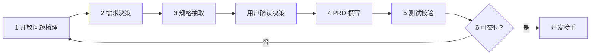

# Cursor 下 PM 工作流（五 Skill · 可迭代）

> **总目标**：从模糊反馈 / 零散文档 → **可开发、可验收** 的 PRD，并用测试视角反向校验完整性。  
> **原则**：总-分结构；**按模块**写清流程、原型、交互、异常；需求变更后从任意一步回灌再生成。

### 0. 强制门禁（与用户协作约定）

**默认**：AI **先**完成分析 + 决策草案（必要时含开放问题梳理与规格抽取），**与你确认清楚**（做/不做、范围、优先级、方案取舍）后，**再**开始用 prd-writer-master 写完整 PRD。  

- **用户分群 / 多人群策略**：若需求隐含「不同人不同逻辑」，确认清单中**必须**包含 **主人群定义 + 各非主人群策略**（或明确「非主人群与主人群完全一致」）；**未对齐前**不把 §2 写死为可开发终稿（见 `prd-writer-master` 视角 1.5、`Demand Solution Decision` 分群矩阵门禁）。

- **未收到你的显性确认前**：不撰写完整 PRD、不把主 PRD 写入 `docs/{YYYYMMDD}/PRD/...`（避免与用户真实意图不一致）。  
- **PRD 未定稿前**：**不生成、不更新** 该需求目录下的 **`_PRD.html`**；定稿后 AI **提醒**你是否需要 HTML，且**每次**生成或重大更新 HTML **前须你再确认一次**（详见 **`CLAUDE.md`**）。  
- **你的确认**可以是：逐条回复「同意 / 修改第 x 条为…」、或一句「按推荐方案写 PRD」。  
- **例外**：你在同一会话中明确说「跳过确认直接写」或「就按上表执行」等，视为已授权进入 PRD。  
- **HTML 例外**：当轮已明确「确认生成 HTML」「确认更新 HTML」时，视为已授权该次 HTML 操作。  
- **原型 / mockup**：面向本仓 FlareFlow App 时须按 **移动端规范**（见 **`CLAUDE.md`**、**`KNOWLEDGE_BASE.md`** §1.1）。

---

## 一、总览

### 1.1 五 Skill 与仓库路径

| Skill（Cursor 中挂载名） | 仓库内路径 | 在链路中的角色 |
|---------------------------|------------|----------------|
| **open-questions-triage** | `.claude/skills/open-questions-triage/SKILL.md` | 澄清歧义、归类开放问题、排序 |
| **Demand Solution Decision** | `.claude/skills/Demand Solution Decision/SKILL.md` | 决策表：做/不做、优先级、范围 |
| **spec-extractor** | `.claude/skills/spec-extractor/SKILL.md` | 从 md / 表格 / HTML 抽取结构化规格 |
| **prd-writer-master** | `.claude/skills/prd-writer-master/SKILL.md` | 主 PRD：流程、原型、交互、前后端草稿边界 |
| **prd-test-validator** | `.claude/skills/prd-test-validator/SKILL.md` | Gherkin → Playwright + 缺漏报告 |

**扩展（superpowers-zh）**：编程侧方法论（头脑风暴、TDD、调试、Code Review、`workflow-runner` 等）已联结到 `.claude/skills/<技能目录>/SKILL.md`；总入口见 **`.claude/skills/using-superpowers/SKILL.md`**。安装联结：`scripts/link-superpowers-zh.ps1`，路径一行配置：`scripts/superpowers-zh.path`。详见根目录 **`CLAUDE.md`** 对应小节。

### 1.2 推荐执行顺序（六步）

| 步骤 | 使用 Skill | 主要输入 | 主要输出 |
|------|-------------|----------|----------|
| 1 | open-questions-triage | 用户反馈、会议纪要、模糊一句话需求 | **清晰问题列表**（分类、优先级、是否阻塞） |
| 2 | Demand Solution Decision | 问题列表 + 业务约束 | **决策表**（做/不做、P0–P3、范围边界） |
| 3 | spec-extractor | 旧 PRD、飞书导出、HTML、表格 | **规格摘要 / 字段与规则清单**（供 2、4 引用） |
| **—** | **（门禁）** | 决策表草案 | **用户显性确认**后再进入步骤 4 |
| 4 | prd-writer-master | 已确认决策 + 规格 + 设计约束 | **完整 PRD**（流程图、路径、原型、控件、异常、影响范围） |
| 5 | prd-test-validator | PRD 定稿（尤其 5.x.6 Gherkin） | **test-coverage-report** + 可选 Playwright 骨架 |
| 6 | （产品拍板） | 第 5 步报告 | **交付开发的主 PRD `.md`**（真理源） |

**说明**：步骤 2 与 3 可并行或先 3 后 2——有现成文档时先 **spec-extractor** 再决策，能减少拍脑袋。**步骤 4 前必须有用户确认**（见上文 §0），除非用户明确授权跳过。

### 1.3 在 Cursor 里怎么用

1. 在对话中 **@ 对应 SKILL 文件** 或说明「按 open-questions-triage 执行」。  
2. **决策与 PRD 之间**：先产出决策表 / 确认清单，**等用户回复确认**后再 @ **prd-writer-master** 开写（见 §0）。  
3. **prd-writer-master** 体量大：写作时一并 @ `prd-writer-master` 目录下的 `interaction_detail_standard.md`、`prd_vs_techspec_boundary.md`、`html_ui_rendering_standard.md` 等子文档（见该 Skill 正文索引）。  
4. 固定智能体（可选）：`.claude/agents/demand-decision-agent.md`、`.claude/agents/prd-writer-agent.md` —— 与上表 Skill 配套；**即使用 Agent，仍须在 PRD 前保留用户确认门禁**（除非用户声明跳过）。

### 1.4 迭代方式

| 变更类型 | 建议从哪步重来 |
|----------|----------------|
| 补充用户原话 / 新反馈 | 从 **1** 或仅更新 **2** 决策表 |
| 旧文档修订、新增接口说明 | **3** 重抽 + **4** 合并 |
| 交互、文案、边界微调 | **4** 增量改 PRD |
| 验收口径变化 | **4** 改 5.x.6 + **5** 重跑校验 |

---

## 二、分步说明（每步产出物长什么样）

### 2.1 open-questions-triage

- **你要的**：每条反馈对应「问什么、缺什么信息、是否挡研发」。  
- **产出结构建议**：按类聚合（歧义 / 缺数据 / 跨角色冲突 / 业务判断 / 优先级）；同类内 **紧急在前**。  
- **可视化**：用 Markdown 表格列出 `编号 | 原文摘要 | 问题类型 | 建议追问 | 阻塞?`。

### 2.2 Demand Solution Decision

- **你要的**：每条需求 **做 or 不做**、优先级、版本范围、依赖角色。  
- **产出结构建议**：问题陈述 → 候选方案（快/全/长期）→ **推荐方案** → 验收与风险。  
- **与 PRD 关系**：决策表里写死的「不做」不要在 PRD 里又写成要做。

### 2.3 spec-extractor

- **你要的**：从任意载体抽出 **可机器引用** 的字段、枚举、规则、接口意图（非实现级 DDL）。  
- **产出**：结构化小节（User Story / 规则表 / 数据字典片段），直接粘贴进决策讨论或 PRD 第 5 章引用。

### 2.4 prd-writer-master

按 **功能模块** 组织，每模块建议固定包含：

| 小节 | 内容 |
|------|------|
| 流程 | Mermaid `flowchart` / `stateDiagram`（用户路径、状态机） |
| 原型 | Markdown 内 **ASCII 线框**（评审用）；若本仓要求 HTML 派生，则遵守 `html_ui_rendering_standard.md` |
| 交互 | 按钮 / 输入 / 跳转 / 加载 / 空态 / 权限不足 |
| 异常 | 网络失败、超时、非法输入、业务规则拒绝 |
| 前后端 | PM 侧写 **行为与契约草稿**；技术实现细节标「研发深化」见 `prd_vs_techspec_boundary.md` |

### 2.5 prd-test-validator

- **输入**：PRD 中 **5.x.6 Gherkin Scenario** 齐全。  
- **输出**：`test-coverage-report.md`（PRD ↔ 测试双向对照）；缺场景 = PRD 模糊点。  
- **落地路径**：按本仓库批次约定，落在 `docs/{YYYYMMDD}/PRD/{需求名}/`（见 prd-test-validator SKILL 内目录树）。

---

## 三、与本仓库其它约定的关系

| 文档 | 作用 |
|------|------|
| 根目录 `CLAUDE.md` | FlareFlow 目录、真理源优先级、交付物不落盘外 |
| `flareflow-app-snapshot/KNOWLEDGE_BASE.md` | FF 产品线历史与基线 |
| 本文件 | **Skill 串联顺序** 与每步产出形态（Cursor 专用） |

**冲突优先级**（与 `CLAUDE.md` 一致）：当期 **`docs/{YYYYMMDD}/PRD/.../*.md` 真理源** > 本工作流描述 > 历史文档背景。

---

## 四、自检清单（交给开发前）

- [ ] 决策表与 PRD 范围一致，无「已砍需求」残留  
- [ ] 每模块：流程图 + 原型 + 交互 + 异常  
- [ ] 5.x.3 控件清单与线框图控件 **一一对应**  
- [ ] 5.x.6 Gherkin 可执行、可判定  
- [ ] 已跑 **prd-test-validator**，报告中的 ⚠️ 已处理或已签字接受  

---

*文档版本：与仓库内 `.claude/skills` 同步维护；Skill 正文以各 `SKILL.md` 为准。*
